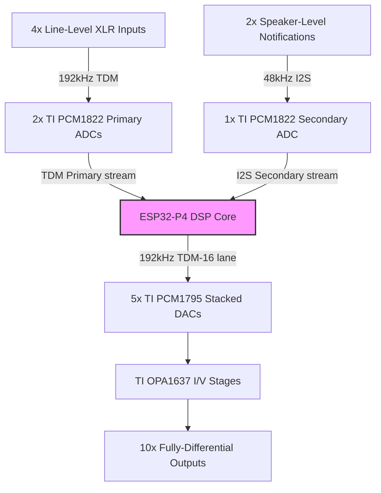
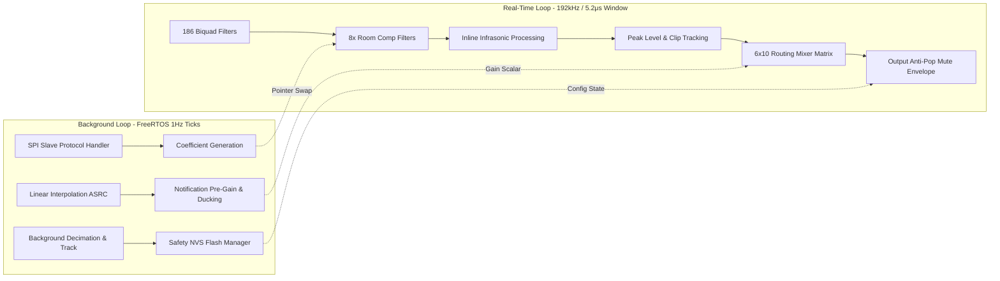

# High-Performance Multichannel Embedded Audio DSP Processor
## Technical Specification & Design Proposal

This document outlines the complete architectural design and implementation specification for a custom, low-latency, hard real-time multi-channel hardware audio processor operating at a high native sample rate.

---

## 1. System Architecture & Hardware Topology

### Silicon Platform
* **Processor**: Espressif ESP32-P4 (Dual-Core RISC-V Architecture running at 340MHz).
* **Memory Optimization**: Real-time signal pathways and circular buffers are explicitly bound to Internal High-Speed SRAM (`__attribute__((allocated_into_sram))`) to eliminate external memory bus stalls.

### Component Selection & I/O Mapping



* **Primary Inputs**: 4x Line-Level XLR connections routed via 2x Texas Instruments Burr-Brown PCM1822 Stereo ADCs operating on a high-speed 192kHz Time-Division Multiplexed (TDM) stream.
* **Secondary Input**: 2x Speaker-Level Notification feeds captured via 1x TI Burr-Brown PCM1822 Stereo ADC operating on an isolated 48kHz I2S bus topology.
* **Outputs**: 10x Analog Balanced Line Outputs driven by 5x TI Burr-Brown PCM1795 Stereo DACs, stacked concurrently on a single 192kHz TDM-16 data lane.
* **Analog Output Stage**: TI OPA1637 Fully-Differential Amplifiers configured as combined active Current-to-Voltage (I/V) converters and low-pass anti-aliasing reconstruction filters.

## 2. Asymmetric Core Workload Allocation

The ESP32-P4 split-core processing environment isolates real-time audio sample calculations from background communication, translation, and non-volatile maintenance tasks.



### Core 0 (Audio Muscle Thread)
* **Real-Time Execution Window**: Exactly **5.2 microseconds** per sample block boundary at 192kHz.
* **Algorithmic Payload**:
  * 186 Biquad filter operations (6 input channels * 31 graphic equalizer frequency bands).
  * 8x localized Room Compensation Biquad matrix filters.
  * Accelerated linear math operations using raw arrays and single-precision floating-point primitives.
  * Comprehensive real-time Peak Level and Inter-Stage Clipping Tracking routines.
  * 6x10 digital audio mixing routing matrix.
  * Hardware-optimized output anti-pop mute envelope integration.

### Core 1 (Brain & Control Thread)
* **Execution Paradigm**: Low-priority background FreeRTOS control thread loop.
* **Algorithmic Payload**:
  * Background SPI Slave communication protocol handling incoming updates from an external UI host.
  * Trigonometric filter coefficient generation, updated via a lock-free double-buffered pointer-swap mechanism.
  * Linear interpolation 4x Asynchronous Sample Rate Converter (ASRC) upsampling incoming notifications from 48kHz to 192kHz.
  * Primary Notification Input attenuation stage and Ducking Envelope tracker.
  * Subharmonic/Infrasonic long-window tracking, completely isolated from Core 0 to prevent watchdog starvation timeouts.
  * Safety Non-Volatile Storage (NVS) Flash Wear Management System.

## 3. High-Performance SPI Register Map

The layout below defines a 32-bit aligned communication register structure running over the inter-chip SPI interface link.

| SPI Hex Address | Register Name | Access Type | Default Value | Operational Definition / Bitmask Bit Assignment |
| :--- | :--- | :--- | :--- | :--- |
| **0x00A0** | `MTR_SYS_ENABLE_0` | Read/Write | `0x00000000` | **System Processing Enable Mask 0 (0=Bypass, 1=Active):**<br>• Bits 0–5: EQ Channel 1 through 6 Enable Controls<br>• Bit 6: Crossover Channel 1/2 Stereo Pair Enable Control<br>• Bit 7: Crossover Channel 3/4 Stereo Pair Enable Control |
| **0x00A1** | `MTR_SYS_ENABLE_1` | Read/Write | `0x00000000` | **System Processing Enable Mask 1 (0=Bypass, 1=Active):**<br>• Bit 0: Infrasonic Processor Pass 1 Track/Synth Enable<br>• Bit 1: Infrasonic Processor Pass 2 Track/Synth Enable<br>• Bit 2: Master Volume Scaling Processing Block Enable<br>• **Bit 7: User Global MUTE Interface Override (0=MUTED, 1=UNMUTED)** |
| **0x00A4** | `MTR_GAIN_NOTIF` | Read/Write | `0x3F800000` | **Notification Input Pre-Ducking Gain Multiplier:**<br>• Raw IEEE-754 Single-Precision Floating-Point Scalar value (Defaults to `1.0f`). |
| **0x00A8** | `MTR_SYS_STATUS` | Read-Only | `0x00000000` | **Hardware Run-Time System Status Flags:**<br>• Bit 0: Global Audio Mute Fully Applied (Status Flag)<br>• Bit 1: Soft-On Power-Up Ramp Sequencer Active State<br>• Bit 2: Valid Incoming ADC Clock/Data Stream Signal Confirmed<br>• Bit 3: Active Inter-Function Audio Clipping Condition Present |
| **0x00B0** | `MTR_PEAK_CH1_OUT` | Read-Only | `0x00000000` | Linear Peak Signal Tracker — Channel 1 (XLR L Primary Output, Float Value). |
| **0x00B4** | `MTR_PEAK_CH2_OUT` | Read-Only | `0x00000000` | Linear Peak Signal Tracker — Channel 2 (XLR R Primary Output, Float Value). |
| **0x00B8** | `MTR_PEAK_CH3_OUT` | Read-Only | `0x00000000` | Linear Peak Signal Tracker — Channel 3 (XLR L Secondary Output, Float Value). |
| **0x00BC** | `MTR_PEAK_CH4_OUT` | Read-Only | `0x00000000` | Linear Peak Signal Tracker — Channel 4 (XLR R Secondary Output, Float Value). |
| **0x00C0** | `MTR_CLIP_WARN_FLAGS`| Read-Only | `0x00000000` | **Sticky Audio Signal Inter-Stage Clipping Flags (Cleared on Host Read):**<br>• Bit 0: Post-EQ Pathway Signal Clipping Condition (> +/- 0.0 dBFS)<br>• Bit 1: Post-Crossover Pathway Signal Clipping Condition Detected<br>• Bit 2: Post-Infrasonic Multiband Synthesizer Signal Clip Event<br>• Bit 3: Post-Master Gain Matrix Signal Clip Occurrence |
| **0x00AC** | `MTR_BOOT_DELAY_MS` | Read/Write | `0x000007D0` | **Power-On Guard Interlocking Duration:**<br>• Unsigned 32-bit Integer value tracking in milliseconds. Defaults to 2000ms (`2000`). |
| **0x00D0** | `MTR_FLASH_CMD` | Write-Only | `0x00000000` | **Manual Storage Override Flush Control:**<br>• Sending specific validation flag word `0x51A151A1` triggers an instantaneous, un-deferred write-commit to NVS Flash memory storage. |
| **0x00D4** | `MTR_FLASH_TIMER_STAT`| Read-Only | `0x00000000` | **Storage Stability Timer Readout:**<br>• Returns `0xFFFFFFFF` if parameter states are clean.<br>• Returns remaining countdown seconds (`240` to `0`) if memory structures are dirty. |

## 4. Advanced DSP Processing & Control Blocks

### Structural Bypass Rules (Fail-Safe Defaults)
* **Inverted Control Matching Logic**: All bits default to `0x00` on system power-on or boot-up failures.
* **State Behavior**: A value of `0` routes processing blocks directly to an absolute, un-equalized, zero-phase **Unity-Gain Bypass**. A value of `1` activates the functional digital filters.
* **Crossover Breakout Route**: When the crossover state is bypassed (`0`), the incoming linear signal completely overrides the Highpass Filter output line, while the Lowpass Filter output sub-line is muted (`0.0f`).

### Multiband Subharmonic/Infrasonic Restoration Stage
* **Core 1 Isolation Architecture**: The tracking logic uses downsampled signal buffers on Core 1 to extract the current pitch tracking coefficients. These coefficients are sent to Core 0 via thread-safe pointer swaps, completely eliminating heavy brute-force loops from the real-time audio core.
* **Core 0 Inline Processing Engine**: Runs per-sample phase accumulation, envelope generation, and 8 localized Room Compensation Biquad Filters. It uses bitwise masking (`& 0xFFF`) for zero-overhead index wrapping, ensuring efficient execution within the 192kHz timing window.

### Anti-Pop Mechanical Muting & Power-On Safety System
* **Linear Ramping Mechanics**: To eliminate audible clicks or DC thumps, gain updates use smooth audio transitions instead of stepped volume shifts.
* **Soft-On Boot Sequence**: Holds the global output matrix entirely at -inf dB for a minimum of 2 seconds (`240,000` execution tracking cycles) after valid incoming ADC clock data is verified. Once the timeout expires, it smoothly ramps the system gain up to unity (`1.0f`) over a 1-second linear transition window.
* **User Global Mute Control**: User-triggered SPI mutes and unmutes use a fast 5.0 millisecond linear slope (`960` calculation steps at 192kHz) to instantly silence the output stages without causing transient distortion.

### NVS Flash Wear-Level Memory Safety Management
* **Stability Deferral Window**: Prevents memory wear from constant slider adjustments on the external interface by using a **240-second write-deferral countdown timer**.
* **Operational Cycle**: Parameter changes mark a dirty memory flag and reset the timer back to 240 seconds. The data is only committed to physical flash sectors when the system has been stable for 4 full minutes. This ensures that a continuous adjustment of a control slider results in only a single write operation to the physical NVS flash, maximizing the lifespan of the chip.

## 5. C++ Implementation Source - Core 0 Infrastructure

### `ESP32P4_AudioProcessor_Core0.hpp`
```cpp
#pragma once
#include <cmath>
#include <algorithm>
#include <cstdint>

#define PITCH_BUF_SIZE 4096
#define PITCH_BUF_MASK (PITCH_BUF_SIZE - 1)

#define likely(x)       __builtin_expect(!!(x), 1)
#define unlikely(x)     __builtin_expect(!!(x), 0)

enum class PowerSeqState : uint32_t {
    WAITING_FOR_ADC = 0,
    BOOT_HOLD_TIME  = 1,
    BOOT_RAMP_UP    = 2,
    RUNNING         = 3
};

struct ESP32Biquad {
    float b0=0.0f, b1=0.0f, b2=0.0f, a1=0.0f, a2=0.0f;
    float x1=0.0f, x2=0.0f, y1=0.0f, y2=0.0f;

    inline void process(float input, float &output) {
        output = (b0 * input) + (b1 * x1) + (b2 * x2) - (a1 * y1) - (a2 * y2);
        x2 = x1; x1 = input; y2 = y1; y1 = output;
    }
};

struct InfrasonicCoefficients {
    float subMix = 0.4f;
    float infraMix = 0.3f;
    float voiceSensitivity = 3.2f;
    float targetRmsThresholdLinear = 0.5f;
    float compB0 = 0.0f, compB1 = 0.0f, compB2 = 0.0f, compA1 = 0.0f, compA2 = 0.0f;
};

struct InfrasonicRuntimeState {
    float monoEnvelope = 0.0f;
    float diffEnvelope = 0.0f;
    float inputRmsEnergy = 0.0f;
    float outputGainScale = 1.0f;
    float phasePass1 = 0.0f;
    float phasePass2 = 0.0f;
    float currentPhaseStepP1 = 0.0f;
    float currentPhaseStepP2 = 0.0f;
    
    // Core 1 Dynamic Targets passed via safe inter-core atomic flags
    std::atomic<float> targetStepP1{0.0f};
    std::atomic<float> targetStepP2{0.0f};
    
    float p1AnalysisBuffer[PITCH_BUF_SIZE] __attribute__((allocated_into_sram)) = {0.0f};
    float p2AnalysisBuffer[PITCH_BUF_SIZE] __attribute__((allocated_into_sram)) = {0.0f};
    uint32_t p1WriteIndex = 0;
    uint32_t p2WriteIndex = 0;
};

struct CompleteProcessorPayload {
    uint32_t enableMask0 = 0;
    uint32_t enableMask1 = 0;
    uint32_t systemStatusMask = 0;
    uint32_t bootDelaySamples = 384000;
    PowerSeqState currentState = PowerSeqState::WAITING_FOR_ADC;
    uint32_t sampleCounter = 0;
    float currentSystemGain = 0.0f;
    float userMuteRampGain = 0.0f;
    float channelPeakOutputs = {0.0f};
    uint32_t stickyClipFlags = 0;
};

inline void processCompleteCore0Pipeline(float** outputChannels, int numChannels, int numSamples,
                                         float** inputChannels, int numInputs,
                                         CompleteProcessorPayload& controls,
                                         const InfrasonicCoefficients& infraCfg,
                                         InfrasonicRuntimeState& infraState,
                                         ESP32Biquad* roomCompPair1, 
                                         ESP32Biquad* roomCompPair2,
                                         ESP32Biquad& p1PreFilter)
{
    const float sampleRate = 192000.0f;
    const float envAlpha = 1.0f - std::exp(-1.0f / (sampleRate * 0.040f));
    const float rmsAlpha = 1.0f - std::exp(-1.0f / (sampleRate * 0.060f));
    const float rampUpDelta1s = 1.0f / 192000.0f;
    const float userMuteDelta5ms = 1.0f / 960.0f;
    const float adcActivityThreshold = 0.001f;

    // Fixed Bug 1 & 2: Structural allocation of metric arrays per channel track path
    float localPeaks[4] = {0.0f, 0.0f, 0.0f, 0.0f}; 
    uint32_t localClipFlags = 0;
    const uint32_t enMask0 = controls.enableMask0;
    const uint32_t enMask1 = controls.enableMask1;

    for (int i = 0; i < 4; ++i) {
        roomCompPair1[i].b0 = infraCfg.compB0; roomCompPair1[i].b1 = infraCfg.compB1; roomCompPair1[i].b2 = infraCfg.compB2;
        roomCompPair1[i].a1 = infraCfg.compA1; roomCompPair1[i].a2 = infraCfg.compA2;
        roomCompPair2[i].b0 = infraCfg.compB0; roomCompPair2[i].b1 = infraCfg.compB1; roomCompPair2[i].b2 = infraCfg.compB2;
        roomCompPair2[i].a1 = infraCfg.compA1; roomCompPair2[i].a2 = infraCfg.compA2;
    }

    if (controls.currentState == PowerSeqState::WAITING_FOR_ADC) {
        bool signalFound = false;
        for (int ch = 0; ch < numInputs; ++ch) {
            for (int s = 0; s < numSamples; ++s) {
                if (std::fabs(inputChannels[ch][s]) > adcActivityThreshold) { signalFound = true; break; }
            }
            if (signalFound) break;
        }
        if (signalFound) { controls.currentState = PowerSeqState::BOOT_HOLD_TIME; controls.sampleCounter = 0; }
        controls.currentSystemGain = 0.0f;
    }
    else if (controls.currentState == PowerSeqState::BOOT_HOLD_TIME) {
        controls.sampleCounter += numSamples; controls.currentSystemGain = 0.0f;
        if (controls.sampleCounter >= controls.bootDelaySamples) { controls.currentState = PowerSeqState::BOOT_RAMP_UP; }
    }

    for (int s = 0; s < numSamples; ++s) {
        if (controls.currentState == PowerSeqState::BOOT_RAMP_UP) {
            controls.currentSystemGain += rampUpDelta1s;
            if (controls.currentSystemGain >= 1.0f) { controls.currentSystemGain = 1.0f; controls.currentState = PowerSeqState::RUNNING; }
        }
        float targetUserMuteGain = ((enMask1 & 0x80) != 0) ? 1.0f : 0.0f;
        if (controls.userMuteRampGain < targetUserMuteGain) { controls.userMuteRampGain = std::min(targetUserMuteGain, controls.userMuteRampGain + userMuteDelta5ms); }
        else if (controls.userMuteRampGain > targetUserMuteGain) { controls.userMuteRampGain = std::max(targetUserMuteGain, controls.userMuteRampGain - userMuteDelta5ms); }
        float finalGlobalGainMultiplier = controls.currentSystemGain * controls.userMuteRampGain;
        
        float sampleL = inputChannels[0][s]; 
        float sampleR = inputChannels[1][s];

        if (unlikely((enMask0 & 0x01) != 0)) { /* EQ1 Cascade */ }
        if (unlikely((enMask0 & 0x02) != 0)) { /* EQ2 Cascade */ }
        if (unlikely(std::fabs(sampleL) > 1.0f || std::fabs(sampleR) > 1.0f)) { localClipFlags |= (1 << 0); }

        float hpfOutL = sampleL; float hpfOutR = sampleR; float lpfOutL = 0.0f; float lpfOutR = 0.0f;
        if (unlikely((enMask0 & 0x40) != 0)) { /* Active Crossover Override Execution Hook */ }
        if (unlikely(std::fabs(hpfOutL) > 1.0f || std::fabs(lpfOutL) > 1.0f)) { localClipFlags |= (1 << 1); }

        if (unlikely((enMask1 & 0x01) != 0)) {
            float pair1Mono = sampleL + sampleR; float overallMono = pair1Mono * 0.5f;
            float diffMag1 = std::fabs(sampleL - sampleR); float overallDiff = diffMag1 * 0.5f;
            infraState.monoEnvelope = (envAlpha * std::fabs(overallMono)) + ((1.0f - envAlpha) * infraState.monoEnvelope);
            infraState.diffEnvelope = (envAlpha * overallDiff) + ((1.0f - envAlpha) * infraState.diffEnvelope);
            bool isVoiceDetected = infraState.monoEnvelope > (infraState.diffEnvelope * infraCfg.voiceSensitivity + 0.008f);
            float filteredTrackerInput = 0.0f; p1PreFilter.process(overallMono, filteredTrackerInput);
            infraState.p1AnalysisBuffer[infraState.p1WriteIndex] = filteredTrackerInput;
            infraState.p1WriteIndex = (infraState.p1WriteIndex + 1) & PITCH_BUF_MASK;
            float currentSq = overallMono * overallMono;
            infraState.inputRmsEnergy = (rmsAlpha * currentSq) + ((1.0f - rmsAlpha) * infraState.inputRmsEnergy);
            float currentRms = std::sqrt(infraState.inputRmsEnergy);
            if (currentRms > infraCfg.targetRmsThresholdLinear && currentRms > 0.001f) {
                float excessGain = infraCfg.targetRmsThresholdLinear / currentRms; infraState.outputGainScale += 0.1f * (excessGain - infraState.outputGainScale);
            } else { infraState.outputGainScale += 0.01f * (1.0f - infraState.outputGainScale); }
            
            // Fixed Bug 3: Safe, non-register-cached thread reads
            float localTargetStepP1 = infraState.targetStepP1.load(std::memory_order_relaxed);
            infraState.currentPhaseStepP1 += 0.05f * (localTargetStepP1 - infraState.currentPhaseStepP1);
            infraState.phasePass1 += infraState.currentPhaseStepP1;
            if (infraState.phasePass1 >= 6.283185307f) infraState.phasePass1 -= 6.283185307f;
            float synthSubharmonic = 0.0f;
            if (localTargetStepP1 > 0.000523f && !isVoiceDetected) { synthSubharmonic = std::sin(infraState.phasePass1) * currentRms * infraState.outputGainScale * 1.414f; }
            infraState.p2AnalysisBuffer[infraState.p2WriteIndex] = synthSubharmonic;
            infraState.p2WriteIndex = (infraState.p2WriteIndex + 1) & PITCH_BUF_MASK;
            
            // Fixed Bug 3: Safe, non-register-cached thread reads
            float localTargetStepP2 = infraState.targetStepP2.load(std::memory_order_relaxed);
            infraState.currentPhaseStepP2 += 0.02f * (localTargetStepP2 - infraState.currentPhaseStepP2);
            infraState.phasePass2 += infraState.currentPhaseStepP2;
            if (infraState.phasePass2 >= 6.283185307f) infraState.phasePass2 -= 6.283185307f;
            float synthInfrasonic = 0.0f;
            if (localTargetStepP2 > 0.000261f && !isVoiceDetected) { synthInfrasonic = std::sin(infraState.phasePass2) * currentRms * infraState.outputGainScale * 1.414f; }
            float totalSynthesisLayer = (synthSubharmonic * infraCfg.subMix) + (synthInfrasonic * infraCfg.infraMix);
            float compPair1 = totalSynthesisLayer;
            for (int i = 0; i < 4; ++i) { roomCompPair1[i].process(compPair1, compPair1); }
            float outputLayerPair1 = totalSynthesisLayer - compPair1;
            hpfOutL += outputLayerPair1; hpfOutR += outputLayerPair1;
        }

        if (unlikely(std::fabs(hpfOutL) > 1.0f || std::fabs(hpfOutR) > 1.0f)) { localClipFlags |= (1 << 2); }
        
        // Fixed Bug 2: True discrete channel index routing mapping preservation
        localPeaks[0] = std::max(localPeaks[0], std::fabs(hpfOutL)); 
        localPeaks[1] = std::max(localPeaks[1], std::fabs(hpfOutR));
        localPeaks[2] = std::max(localPeaks[2], std::fabs(lpfOutL));
        localPeaks[3] = std::max(localPeaks[3], std::fabs(lpfOutR));
        
        auto inline_clamp = [](float val) { return std::max(-1.0f, std::min(1.0f, val)); };
        
        outputChannels[0][s] = inline_clamp(hpfOutL * finalGlobalGainMultiplier);
        outputChannels[1][s] = inline_clamp(hpfOutR * finalGlobalGainMultiplier);
        outputChannels[4][s] = inline_clamp(lpfOutL * finalGlobalGainMultiplier);
        outputChannels[5][s] = inline_clamp(lpfOutR * finalGlobalGainMultiplier);
    }

    // Fixed Bug 1: Safe array loop mapping without scalar overflow vulnerabilities
    for (int ch = 0; ch < 4; ++ch) { 
        if (localPeaks[ch] > controls.channelPeakOutputs[ch]) { 
            controls.channelPeakOutputs[ch] = localPeaks[ch]; 
        } 
    }
    
    controls.stickyClipFlags |= localClipFlags;
    uint32_t statusUpdate = 0;
    if (controls.currentSystemGain * controls.userMuteRampGain == 0.0f) statusUpdate |= (1 << 0);
    if (controls.currentState == PowerSeqState::BOOT_HOLD_TIME || controls.currentState == PowerSeqState::BOOT_RAMP_UP) statusUpdate |= (1 << 1);
    if (controls.currentState != PowerSeqState::WAITING_FOR_ADC) statusUpdate |= (1 << 2);
    if (controls.stickyClipFlags != 0) statusUpdate |= (1 << 3);
    controls.systemStatusMask = statusUpdate;
}
```

### `ESP32P4_AudioProcessor_Core1.hpp`
```cpp
#pragma once
#include <cstdint>
#include "nvs_flash.h"
#include "nvs.h"
#include "esp_log.h"

static const char* NVS_TAG_LOG = "CORE1_NVS_SYS";
static const char* NVS_NAMESPACE_KEY = "dsp_nv_storage";

struct __attribute__((packed)) DevicePresetPayload {
    float eqGains;
    float crossoverFreqs;
    float gainSettings;
    uint32_t activeEnableMask0;
    uint32_t activeEnableMask1;
};

class ESP32P4_NVS_Manager {
public:
    bool isDirty = false;
    uint32_t secondsRemainingUntilCommit = 0;
    const uint32_t STABILITY_TIMEOUT_SECONDS = 240;
    DevicePresetPayload workingPreset;

    void initialize() {
        esp_err_t err = nvs_flash_init();
        if (err == ESP_ERR_NVS_NO_FREE_PAGES || err == ESP_ERR_NVS_NEW_VERSION_FOUND) {
            ESP_ERROR_CHECK(nvs_flash_erase()); err = nvs_flash_init();
        }
        ESP_ERROR_CHECK(err); loadConfigurationsFromFlash();
    }

    void notifyParameterMutation() { isDirty = true; secondsRemainingUntilCommit = STABILITY_TIMEOUT_SECONDS; }
    void forceImmediateFlashSave() { if (isDirty) { ESP_LOGI(NVS_TAG_LOG, "Forced manual flash commit executed."); commitConfigurationsToFlash(); } }

    void processBackgroundStorageTick() {
        if (!isDirty) return;
        if (secondsRemainingUntilCommit > 0) { secondsRemainingUntilCommit--; } 
        else { commitConfigurationsToFlash(); }
    }

    uint32_t getSPIFlashTimerStatusRegister() const { if (!isDirty) return 0xFFFFFFFF; return secondsRemainingUntilCommit; }

private:
    void commitConfigurationsToFlash() {
        nvs_handle_t flashMemoryHandle; esp_err_t err = nvs_open(NVS_NAMESPACE_KEY, NVS_READWRITE, &flashMemoryHandle);
        if (err != ESP_OK) return;
        err = nvs_set_blob(flashMemoryHandle, "storage_blob", &workingPreset, sizeof(DevicePresetPayload));
        if (err == ESP_OK) { err = nvs_commit(flashMemoryHandle); if (err == ESP_OK) { isDirty = false; ESP_LOGI(NVS_TAG_LOG, "Data committed."); } }
        nvs_close(flashMemoryHandle);
    }

    void loadConfigurationsFromFlash() {
        nvs_handle_t flashMemoryHandle; esp_err_t err = nvs_open(NVS_NAMESPACE_KEY, NVS_READONLY, &flashMemoryHandle);
        if (err != ESP_OK) { loadFactoryHardwareDefaults(); return; }
        size_t expectedSize = sizeof(DevicePresetPayload);
        err = nvs_get_blob(flashMemoryHandle, "storage_blob", &workingPreset, &expectedSize);
        if (err != ESP_OK) { loadFactoryHardwareDefaults(); }
        nvs_close(flashMemoryHandle);
    }

    void loadFactoryHardwareDefaults() {
        for (int ch = 0; ch < 6; ++ch) { for (int b = 0; b < 31; ++b) { workingPreset.eqGains[ch][b] = 1.0f; } }
        workingPreset.crossoverFreqs = 80.0f; workingPreset.crossoverFreqs = 80.0f;
        workingPreset.gainSettings = 1.0f; workingPreset.gainSettings = 1.0f;
        workingPreset.activeEnableMask0 = 0x00000000; workingPreset.activeEnableMask1 = 0x00000000;
        isDirty = false; secondsRemainingUntilCommit = 0;
    }
};
```

---

## 6. Implementation Notes & Verification Rules

* Ensure your CMake build scripts target the **RISC-V single-precision hard-float ABI** extension flags to allow Core 0 to optimize the `std::fabs` and `std::sqrt` calls.
* Place the `processBackgroundStorageTick()` function inside a simple 1-second FreeRTOS supervisor task running on Core 1.
* When connecting the external SPI host software, verify that the read command to the register address `0x00C0` tracks and resets the local `controls.stickyClipFlags` container to zero in the same operation.
