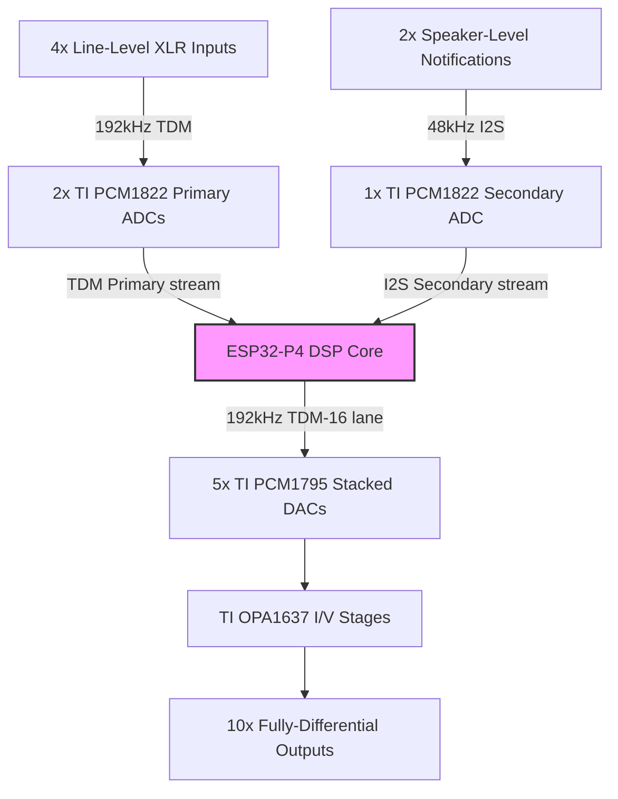
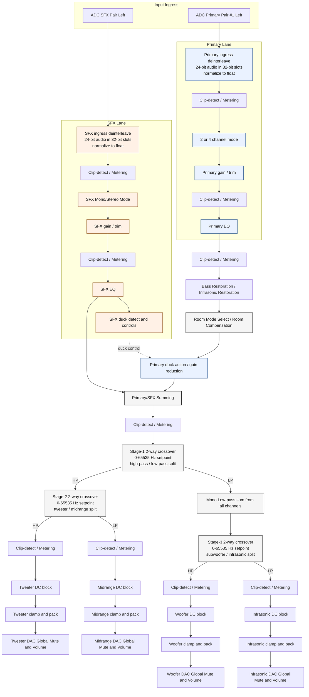
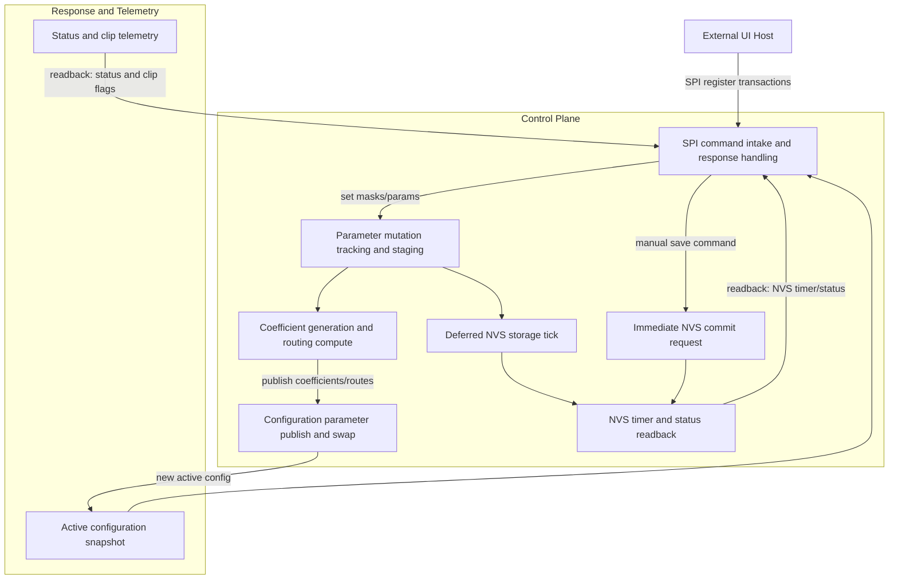

# ESP32-P4 Car Audio DSP

## Project Purpose

"To build a Multichannel Embedded Audio DSP Processor that works the way I want it to."
  
I have a car, and it has a stereo that the manufacturer installed (factory). It sucks, but it works. Most of the issues I have are the inputs and outputs, and what control I have over the audio signal in general. Becasue this particular manufacturer integrated sound effects for things like dash warning lights and backup sensor distance - I can't totally get rid of this PoS without losing that obviously safety/damage-critical functionality. The factory head rolls off bass that I'll never really practically recover, even with remarkable devices that try this - so I'm going to just replace the head unit's media function and keep the old head unit for the sound effects that the head unit must do.
  
Keep in mind this is a work-in-progress, so until you see a picture in this readme of an actual working thing on a bench, this is all fantasy.  I am not offering this code for sale nor do I recommend that anyone try to do that based on this project.  This was a educational learning experience for me, and I wanted to share it with whomever might find the concept and capabilites useful.  This is also a hobby, not a day job, so I am not likely to be fast with the patches and pull requests.

What it is not: This is not a turnkey consumer product, and it is not trying to be a universal vehicle integration framework that magically fits every car and every OEM stack. It does not redesign OEM safety-system logic; the goal is to preserve required safety/notification behavior while improving control of the audio path around it. I make no promise of fixed architecture, but there are no subscriptions, lock-ins, or proprietary control dependencies baked in as a business model.

## Project Scope

This document outlines the complete architectural design and implementation specification for a custom, low-latency, hard-real-time multi-channel audio processor operating at a high native sample rate, and containing those features **I** deem important to have in a car audio processor.

This document covers the audio pipeline firmware only, not the fully integrated end-to-end system.

This processor is not intended to run as a stand-alone product; it is designed to be managed by an external controller over a defined control interface (for example, SPI register transactions).

### System Requirements

The audio processor in this project shall meet the following requirements:

* Provide 4x relatively high-end balanced inputs for program content (channels split left/right and front/rear)
* Provide equalization across all input channels with high band count (target: 31 bands)
* Provide bass compensation capability, including infrasonic bass restoration
* Provide global volume control and mute as close as practical to the outputs, with click/pop suppression
* Provide a cross-over matrix that supports:
  * Bi-Amp the 4x door speakers
  * Have a summed subwoofer channel
  * Have a low-passed VLF infrasonics output I can send to some seat shakers
* Retain the sound effect outputs of the factory head unit, including program-path ducking during SFX override conditions
* Expose sufficient tuning controls to adapt the processor to vehicle-specific system equipment

---

## 1. System Architecture & Hardware Topology

### General Topology

* **Primary Inputs**: 4x Line-Level XLR connections routed via 2x Texas Instruments Burr-Brown PCM1822 Stereo ADCs operating on a high-speed 192kHz Time-Division Multiplexed (TDM) stream.
* **Secondary Input**: 2x Speaker-Level Notification feeds captured via 1x TI Burr-Brown PCM1822 Stereo ADC operating on an isolated 48kHz I2S bus topology.
* **Outputs**: 10x Analog Balanced Line Outputs driven by 5x TI Burr-Brown PCM1795 Stereo DACs, stacked concurrently on a single 192kHz TDM-16 data lane.
* **Analog Output Stage**: TI OPA1637 Fully-Differential Amplifiers configured as combined active Current-to-Voltage (I/V) converters and low-pass anti-aliasing reconstruction filters.

### Silicon Platform

* **Processing Core**: Espressif ESP32-P4 (dual-core RISC-V at 340 MHz) is the main DSP/control processor.
* **Runtime and Memory Constraint**: Every DSP stage in this pipeline must fit inside the compute and memory envelope of the ESP32-P4. To preserve deterministic timing, real-time signal paths and circular buffers are kept in on-die high-speed SRAM whenever possible, and off-chip memory (including PSRAM) is avoided for active processing; this is intended to be enforced through compiler/linker placement controls and memory-region policy, with code loaded from NOR flash into internal memory for execution.
* **Fail-Safe Startup and Default State**: On boot and fault recovery paths, processing features are expected to come up in a conservative pass-through posture until explicitly enabled by control state, so the system favors predictable linear routing over partially initialized processing.
* **Converter Strategy**: The design targets readily available, documented ADC/DAC parts with predictable behavior and accessible integration documentation, with TI parts currently used as the reference path.

## 2. Audio Workloads

### Digital Signal-Path Functional Flow (Single-Channel Reference)

The graph below is the functional signal path reference used to map audio workloads and to illustrate the interconnection of the various audio-processing stages.  For clarity, this graph excludes the bypass paths which circumvent processing stages for diagnostic and calibration purposes.

### Section 2 Block Types (Audio Graph)

* **Ingress and Sample-Normalization Blocks**: The primary-input ingress stage and the SFX ingress stage deinterleave ADC payloads (24-bit audio carried in 32-bit slots) and convert them into normalized floating-point samples for DSP use.
* **Lane-Mode Selection Blocks**: The primary and SFX lane mode blocks set channel routing behavior (for example mono/stereo and 2-channel/4-channel behavior) before downstream shaping and summing.  This allows different input configurations to be processed correctly.
* **Signal Conditioning Blocks**: Gain/trim and equalization stages condition signal amplitude and spectral balance to maximize usable digital headroom through the DSP path before the lanes are combined, or at intermediate stages before another processing stage.
* **Ducking Detection and Gain-Control Blocks**: The SFX path derives ducking control activity from notification content, and that control signal drives attenuation behavior at the primary duck stage before final primary/SFX summing.
* **Program-Shaping and Pre-Crossover Blocks**: The shaped primary program path performs clip observation, bass-restoration processing, room-mode selection, room-compensation filtering, and application of primary signal ducking, then joins the SFX path before pre-crossover metering and crossover split.
  * A reduced-rate analysis path is taken from the live program path to estimate envelope, timing, and pitch-related features for downstream ducking, gain-control, and subharmonic/infrasonic restoration behavior, with adaptive tracking handled at lower rate while fast inline processing remains on the audible path to preserve deterministic real-time execution.
* **Crossover and Band-Partition Blocks**: The staged crossover chain performs high-pass/low-pass partitioning in sequence to produce the final tweeter, midrange, woofer, and infrasonic program bands, including low-pass summing from all channels before the final low-frequency split.
* **Metering Observation Blocks**: Clip-detect and metering taps are intentionally placed at multiple boundaries (ingress, post-gain, post-sum, pre-crossover, and post-split outputs) to make overload localization possible at runtime.
* **Output Protection and Handoff Blocks**: Each output band passes through DC-blocking and clamp/pack stages prior to the final DAC-facing output gain/mute handoff, protecting downstream analog stages from transients and out-of-range values.
* **Bypass and Continuity Blocks**: Structural bypass states are designed so disabled processing stages collapse to clear signal-continuity paths, which supports bring-up, diagnostics, and safe degraded operation without changing physical routing.

## 3. Control Workloads

This section captures the non-audio control-plane flow (SPI transactions, parameter/state mutation handling, coefficient publication, telemetry/status exposure, and deferred NVS persistence) with a dedicated control-workload graph.

### Control Workload Domains

* **Control/Configuration Domain**: The control path receives SPI register commands, stages parameter mutations, generates updated filter and routing coefficients, and applies those updates safely to runtime configuration state.
* **Status and Telemetry Domain**: The control plane exposes live status, clip-fault reporting, and timer readback so the host can query operating state without disturbing the audio path.
* **Persistence/Safety Domain**: Deferred NVS writes, flash-wear protection timing, optional immediate save commands, and boot/power sequencing keep configuration storage and analog-output enable behavior stable while controls are changing.
* **Configuration Exchange Domain**: The control plane publishes updated parameter snapshots and routing state through lock-free pointer swaps so downstream processing can consume a coherent configuration image.

## 4. Asymmetric Core Workload Allocation

The ESP32-P4 split-core processing environment isolates real-time audio sample calculations from background communication, translation, and non-volatile maintenance tasks.  The core doing the DSP things is going to be working very, very hard, and I'll need to keep an eye on die temperatures to make sure my magic rock keeps its magic smoke inside.

### Core 0 (Audio Muscle Thread)

* **Real-Time Execution Window**: Exactly **5.2 microseconds** per sample block boundary at 192kHz.
* **Signal Chain Ownership**: 186 Biquad filter operations (6 input channels * 31 graphic equalizer frequency bands), then 8x localized Room Compensation Biquad matrix filters, inline infrasonic processing, peak level/inter-stage clipping tracking, 6x10 routing mixer matrix, and hardware-optimized output anti-pop mute envelope integration.
* **Metering Ownership (Core 0)**: Performs sample-rate metering at the audio edge, including per-path peak capture and sticky inter-stage clip-flag accumulation used for runtime fault visibility.
* **Compute Style**: Accelerated linear math operations using raw arrays and single-precision floating-point primitives.
* **Inbound Cross-Core Dependencies**: Receives coefficient pointer-swap updates from Core 1 for filter/control-state refresh, receives notification ducking gain scalar updates into the routing/mix path, and consumes configuration state that affects output safety/muting behavior.

### Core 1 (Brain & Control Thread)

* **Execution Paradigm**: Low-priority background FreeRTOS control thread loop.
* **Control/Background Workload**: SPI Slave communication protocol handling incoming updates from an external UI host; trigonometric filter coefficient generation via a lock-free double-buffered pointer-swap mechanism; linear interpolation 4x Asynchronous Sample Rate Converter (ASRC) upsampling incoming notifications from 48kHz to 192kHz; primary notification attenuation plus ducking-envelope tracking; subharmonic/infrasonic long-window tracking isolated from Core 0 to prevent watchdog starvation; and safety Non-Volatile Storage (NVS) flash wear-management handling.
* **Metering/Telemetry Interface (Core 1)**: Exposes status and fault telemetry to the external host via SPI register transactions, including readback of real-time status masks and clear-on-read clip fault reporting behavior.
* **Outbound Cross-Core Outputs**: Publishes coefficient/state pointer swaps consumed by Core 0 filter stages, publishes ducking gain scalar influence consumed by Core 0 mixer behavior, and maintains persistent config state that Core 0 safety/boot/mute paths depend on.

## Documentation Links

### Platform and Architecture

* [Core logic and workload split](docs/ESP32_Core_Logic.md): Defines Core 0/Core 1 responsibility boundaries, execution ownership, and cross-core exchange expectations.
* [Audio topology and SNR justifications](docs/Audio-Topology_Justifications.md): Explains signal-noise tradeoffs, fixed-point and dynamic-range rationale, and topology-level design decisions.

### Bring-Up, Calibration, and Integration

* [Setup and commissioning guide](docs/Setup_Commissioning_Guide.md): Covers first power-on, baseline checks, and safe initial configuration steps.
* [Calibration guide](docs/Calibration_Guide.md): Documents level setting, crossover alignment, and tuning workflow for final system voicing.
* [Software integration guide](docs/Software_Integration_Guide.md): Describes host-side control flow, command usage, and integration patterns.
* [ID and version](docs/ID_Version.md): Defines device identification, capability signaling, and version compatibility context.

### Control Interface and Runtime Behavior

* [Register manual](docs/Register_Manual.md): Canonical map of SPI-addressable controls, status, and register-level behavior.
* [Interrupts](docs/Interrupts.md): Defines IRQ signaling behavior, masks, and host-read interaction model.
* [Channel Modes](docs/Channel_Configuration.md): Explains the channel operating modes and signal paths.
* [Bypass Routing and Control](docs/Bypass_Routing_and_Control.md): Explains path enables, bypass controls.
* [Timing policy](docs/Timing_Policy.md): Canonical startup, mute, and transition-protection timing envelopes.
* [Mute settings](docs/Mute_Settings.md): Details mute-state behavior, transitions, and interaction with output safety handling.
* [Volume settings](docs/Volume_Settings.md): Covers master-level control, scaling boundaries, and runtime level-management behavior.
* [Gain settings](docs/Gain_Settings.md): Describes gain-trim controls for notification and program-path staging.
* [Metering](docs/Metering.md): Defines metering outputs, clip-latch semantics, and runtime observability surfaces.

### Audio Processing Configuration

* [Bass and infrasonic restoration](docs/Bass_Infrasonic_Restoration.md): Canonical bass and infrasonic restoration behavior, blend model, and analysis/update cadence.
* [Crossover points](docs/Crossover_Points.md): Specifies crossover control surfaces, frequency-set behavior, and split-stage expectations.
* [Equalizer settings](docs/EQ_Settings.md): Documents EQ parameter model, band controls, and filter-setting organization.
* [Output conversion and dithering](docs/Output_Conversion.md): Explains final output formatting, conversion path, and dithering control behavior.
