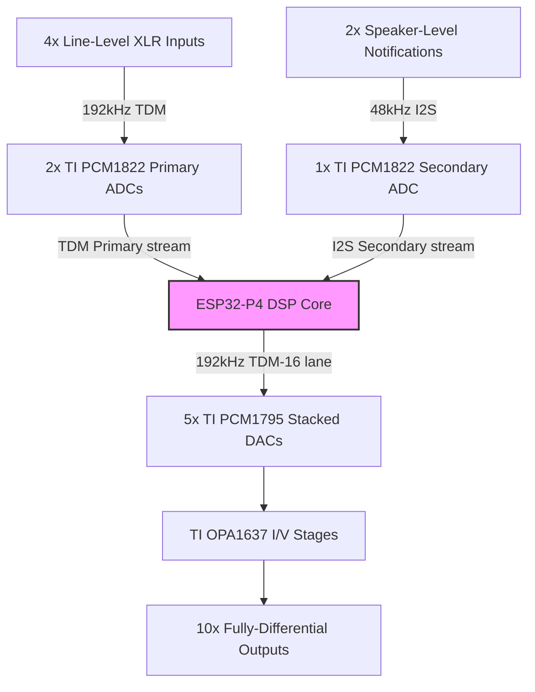
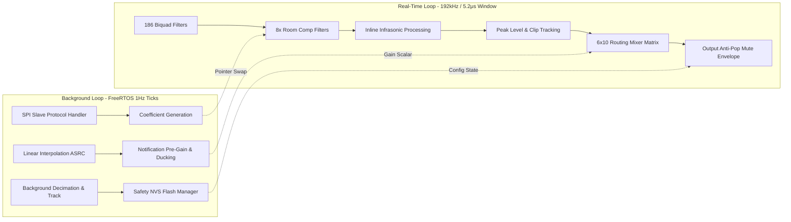

# Multichannel Embedded Audio DSP Processor

Keep in mind this is a work-in-progress, so until you see a picture in this readme of an actual working thing on a bench, this is all fantasy.

## Technical Specification & Design Proposal

Here is where this started.  I have a car, and it has a stereo that the manufacturer installed (factory).  It sucks, but it works.  Most of the issues I have are the inputs and outputs, and what control I have over the audio signal in general.  Becasue this particular manufacturer integrated sound effects for things like dash warning lights and backup sensor distance - I can't totally get rid of this PoS without losing that obviously safety/damage critical functionality.  The factory head rolls off bass that I'll never really practically recover, even with remarkable devices that try this - so I'm going to just replace the head unit's media function and keep the old head unit for the sound effects that the head unit must do.

I have been doing car audio since the mid-1990s, and I've been an audio engineer doing live sound and studio work for decades.  There are functions that historically were done with discreet devices equalizers, multi-way crossovers, bass resotration, but as time and technology has progressed these have increasingly become more integrated and the legacy features are now scarce.  I have personally found that as functions and features have become more and more integrated, the actual funcitons themselves no longer do what was desired, and the Commercial-Off-The-Shelf devices are not capable (and increasingly totally within a walled garden or code).  I tried building this with COTS DSP devices, but I always ran into the "you can't do that", "we don't support that configuration", "you can't change the firmware", "you are a bad person and emails from people like you give me nightmares..." replies.  I give up trying to get what I want from someone who will sell it to me.  Fine.  Challenge accepted, that's the American way, I'll do it myself.

This document outlines the complete architectural design and implementation specification for a custom, low-latency, hard-real-time multi-channel audio processor operating at a high native sample rate, and containing those features **I** deem important to have in a car audio processor.  Some of this concept pulls from now-expired patents, and I'm not an attorney so I'm not even going to try to list those here - as a result, I am not offering this code for sale nor do I recommend that anyone try to do that based on this project.  This was a educational learning experience for me, and I wanted to share it with whomever might find the concept and capabilites useful.

Here's what I need from a new head-unit:
* 4x realatively high-end balanced inputs for program content (channels split left/right and front/rear)
* Equalization across all of the input channels, lots of bands... I like 31.
* As much bass compensation as possible, some infrasonic bass restoration - and I WANNA have a seat shaker for those low-low infrasonics!!
* Global volume control and mute as close as possible to the outputs, and no clicks or pops!
* A complicated cross-over matrix that allows me to:
  + Bi-Amp the 4x door speakers
  + Have a summed subwoofer channel
  + Have a low-passed VLF infrasonics output I can send to some seat shakers
* Must retain the sound effect outputs of the factory head unit, which means program audio needs to "duck" when there is an SFX override.
* Everything needs to be tunable so that I can - well... tune the processor to the system equipment I have in the vehicle I have.

Just reading that list, if I was going to try to do this with descrete COTS hardware, I could see using:
* 4x AudioControl EQT 30-band equalizers (only one channel each)
* Something that does base restoration from roll-off like an AudioControl LCQ-1 Speaker-level to line level converter (see how this already doesn't fit with the line level outputs of the EQTs?)
* An AudioControl LC1 to recover the speaker-level sound effect output of the factory deck
* A pair of 1-to-2 line level distribution amps to split the line level L/R pair to the two pairs of program input
* An audio ducking detector like what you get with a public address system for the SFX input
* A pair of stereo summing mixers to put the SFX lines into the progame pairs
* 2x stereo crossovers to split the door speaker and LFE signals
* 4x 2-way crossovers to split the door speaker otuputs for bi-amping
* Another summing amplifier with 4x inputs to create a mono-LFE channel
* Another 2-way cross-over to split the woofer and seat shakers
* 5x stereo or 10x mono volumen controls that I can control from a single knob (I don't want a knob)

That is a trunk full of conventional gear, and I still want to use my trunk.  And I haven't even talked about amps or power for this yet.  I do mention AudioControl products above, I am not affiliated with nor am I paid to talk about them - that's just what I used to prefer/install, and I have a bunch of their gear still from past installs.  And no, their DSP offerings will not work for this - I tried.

This document is for *JUST* the audio processor portion, not the media player or the controls for the processor a user might interface with, but I think those familair with the process will see that "an ESP32 will easily talk to another ESP32 of a different class over a predefined comon interface protocol" - here, SPI, with a defined register map.  That will come next.

---

## 1. System Architecture & Hardware Topology

### Silicon Platform
* **Readily Available Performance Processor**: Espressif ESP32-P4 (Dual-Core RISC-V Architecture running at 340MHz).
  * **Memory Optimization**: Real-time signal pathways and circular buffers are explicitly bound to Internal High-Speed SRAM (`__attribute__((allocated_into_sram))`) to eliminate external memory bus, or related stalls.
  * All the DSP functions have to fit in the hardware capabilites of the ESP32-P4, this will require tuning algorithms.
* Common ADC/DAC parts capable of force-feeding the ESP32-P4 with the audio data I need the DSP to consume, and not sound like garbage doing it.  I find TI typically warrants attention here, and so I've focussed on their offerings.  I find that I also don't ned to beg for NDA access to walled off datasheets with TI, so take this as a lesson in supply chains you companies that think your blob of silicon is so special a customer has to order 10Million units before you even answer a URL request... Cheers! ;-P

### Component Selection & I/O Mapping



* **Primary Inputs**: 4x Line-Level XLR connections routed via 2x Texas Instruments Burr-Brown PCM1822 Stereo ADCs operating on a high-speed 192kHz Time-Division Multiplexed (TDM) stream.
* **Secondary Input**: 2x Speaker-Level Notification feeds captured via 1x TI Burr-Brown PCM1822 Stereo ADC operating on an isolated 48kHz I2S bus topology.
* **Outputs**: 10x Analog Balanced Line Outputs driven by 5x TI Burr-Brown PCM1795 Stereo DACs, stacked concurrently on a single 192kHz TDM-16 data lane.
* **Analog Output Stage**: TI OPA1637 Fully-Differential Amplifiers configured as combined active Current-to-Voltage (I/V) converters and low-pass anti-aliasing reconstruction filters.

## 2. Asymmetric Core Workload Allocation

The ESP32-P4 split-core processing environment isolates real-time audio sample calculations from background communication, translation, and non-volatile maintenance tasks.  The core doing the DSP things is going to be working very, very hard, and I'll need to keep an eye on die temperatures to make sure my magic rock keeps its magic smoke inside.



### Core 0 (Audio Muscle Thread)
* **Real-Time Execution Window**: Exactly **5.2 microseconds** per sample block boundary at 192kHz.
* **Algorithmic Payload**:
  * 186 Biquad filter operations (6 input channels * 31 graphic equalizer frequency bands).
  * 8x localized Room Compensation Biquad matrix filters.
  * Accelerated linear math operations using raw arrays and single-precision floating-point primitives.
  * Comprehensive real-time Peak Level and Inter-Stage Clipping Tracking routines.
  * 6x10 digital audio mixing routing matrix.
  * Hardware-optimized output anti-pop mute envelope integration.

### Core 1 (Brain & Control Thread)
* **Execution Paradigm**: Low-priority background FreeRTOS control thread loop.
* **Algorithmic Payload**:
  * Background SPI Slave communication protocol handling incoming updates from an external UI host.
  * Trigonometric filter coefficient generation, updated via a lock-free double-buffered pointer-swap mechanism.
  * Linear interpolation 4x Asynchronous Sample Rate Converter (ASRC) upsampling incoming notifications from 48kHz to 192kHz.
  * Primary Notification Input attenuation stage and Ducking Envelope tracker.
  * Subharmonic/Infrasonic long-window tracking, completely isolated from Core 0 to prevent watchdog starvation timeouts.
  * Safety Non-Volatile Storage (NVS) Flash Wear Management System.

## 3. High-Performance SPI Register Map

The layout below defines a 32-bit aligned communication register structure running over the inter-chip SPI interface link.

| SPI Hex Address | Register Name | Access Type | Default Value | Operational Definition / Bitmask Bit Assignment |
| :--- | :--- | :--- | :--- | :--- |
| **0x00A0** | `MTR_SYS_ENABLE_0` | Read/Write | `0x00000000` | **System Processing Enable Mask 0 (0=Bypass, 1=Active):**<br>• Bits 0–5: EQ Channel 1 through 6 Enable Controls<br>• Bit 6: Crossover Channel 1/2 Stereo Pair Enable Control<br>• Bit 7: Crossover Channel 3/4 Stereo Pair Enable Control |
| **0x00A1** | `MTR_SYS_ENABLE_1` | Read/Write | `0x00000000` | **System Processing Enable Mask 1 (0=Bypass, 1=Active):**<br>• Bit 0: Infrasonic Processor Pass 1 Track/Synth Enable<br>• Bit 1: Infrasonic Processor Pass 2 Track/Synth Enable<br>• Bit 2: Master Volume Scaling Processing Block Enable<br>• **Bit 7: User Global MUTE Interface Override (0=MUTED, 1=UNMUTED)** |
| **0x00A4** | `MTR_GAIN_NOTIF` | Read/Write | `0x3F800000` | **Notification Input Pre-Ducking Gain Multiplier:**<br>• Raw IEEE-754 Single-Precision Floating-Point Scalar value (Defaults to `1.0f`). |
| **0x00A8** | `MTR_SYS_STATUS` | Read-Only | `0x00000000` | **Hardware Run-Time System Status Flags:**<br>• Bit 0: Global Audio Mute Fully Applied (Status Flag)<br>• Bit 1: Soft-On Power-Up Ramp Sequencer Active State<br>• Bit 2: Valid Incoming ADC Clock/Data Stream Signal Confirmed<br>• Bit 3: Active Inter-Function Audio Clipping Condition Present |
| **0x00B0** | `MTR_PEAK_CH1_OUT` | Read-Only | `0x00000000` | Linear Peak Signal Tracker — Channel 1 (XLR L Primary Output, Float Value). |
| **0x00B4** | `MTR_PEAK_CH2_OUT` | Read-Only | `0x00000000` | Linear Peak Signal Tracker — Channel 2 (XLR R Primary Output, Float Value). |
| **0x00B8** | `MTR_PEAK_CH3_OUT` | Read-Only | `0x00000000` | Linear Peak Signal Tracker — Channel 3 (XLR L Secondary Output, Float Value). |
| **0x00BC** | `MTR_PEAK_CH4_OUT` | Read-Only | `0x00000000` | Linear Peak Signal Tracker — Channel 4 (XLR R Secondary Output, Float Value). |
| **0x00C0** | `MTR_CLIP_WARN_FLAGS`| Read-Only | `0x00000000` | **Sticky Audio Signal Inter-Stage Clipping Flags (Cleared on Host Read):**<br>• Bit 0: Post-EQ Pathway Signal Clipping Condition (> +/- 0.0 dBFS)<br>• Bit 1: Post-Crossover Pathway Signal Clipping Condition Detected<br>• Bit 2: Post-Infrasonic Multiband Synthesizer Signal Clip Event<br>• Bit 3: Post-Master Gain Matrix Signal Clip Occurrence |
| **0x00AC** | `MTR_BOOT_DELAY_MS` | Read/Write | `0x000007D0` | **Power-On Guard Interlocking Duration:**<br>• Unsigned 32-bit Integer value tracking in milliseconds. Defaults to 2000ms (`2000`). |
| **0x00D0** | `MTR_FLASH_CMD` | Write-Only | `0x00000000` | **Manual Storage Override Flush Control:**<br>• Sending specific validation flag word `0x51A151A1` triggers an instantaneous, un-deferred write-commit to NVS Flash memory storage. |
| **0x00D4** | `MTR_FLASH_TIMER_STAT`| Read-Only | `0x00000000` | **Storage Stability Timer Readout:**<br>• Returns `0xFFFFFFFF` if parameter states are clean.<br>• Returns remaining countdown seconds (`240` to `0`) if memory structures are dirty. |

## 4. Advanced DSP Processing & Control Blocks

### Structural Bypass Rules (Fail-Safe Defaults)
* **Inverted Control Matching Logic**: All bits default to `0x00` on system power-on or boot-up failures.
* **State Behavior**: A value of `0` routes processing blocks directly to an absolute, un-equalized, zero-phase **Unity-Gain Bypass**. A value of `1` activates the functional digital filters.
* **Crossover Breakout Route**: When the crossover state is bypassed (`0`), the incoming linear signal completely overrides the Highpass Filter output line, while the Lowpass Filter output sub-line is muted (`0.0f`).

### Multiband Subharmonic/Infrasonic Restoration Stage
* **Core 1 Isolation Architecture**: The tracking logic uses downsampled signal buffers on Core 1 to extract the current pitch tracking coefficients. These coefficients are sent to Core 0 via thread-safe pointer swaps, completely eliminating heavy brute-force loops from the real-time audio core.
* **Core 0 Inline Processing Engine**: Runs per-sample phase accumulation, envelope generation, and 8 localized Room Compensation Biquad Filters. It uses bitwise masking (`& 0xFFF`) for zero-overhead index wrapping, ensuring efficient execution within the 192kHz timing window.

### Anti-Pop Mechanical Muting & Power-On Safety System
* **Linear Ramping Mechanics**: To eliminate audible clicks or DC thumps, gain updates use smooth audio transitions instead of stepped volume shifts.
* **Soft-On Boot Sequence**: Holds the global output matrix entirely at -inf dB for a minimum of 2 seconds (`240,000` execution tracking cycles) after valid incoming ADC clock data is verified. Once the timeout expires, it smoothly ramps the system gain up to unity (`1.0f`) over a 1-second linear transition window.
* **User Global Mute Control**: User-triggered SPI mutes and unmutes use a fast 5.0 millisecond linear slope (`960` calculation steps at 192kHz) to instantly silence the output stages without causing transient distortion.

### NVS Flash Wear-Level Memory Safety Management
* **Stability Deferral Window**: Prevents memory wear from constant slider adjustments on the external interface by using a **240-second write-deferral countdown timer**.
* **Operational Cycle**: Parameter changes mark a dirty memory flag and reset the timer back to 240 seconds. The data is only committed to physical flash sectors when the system has been stable for 4 full minutes. This ensures that a continuous adjustment of a control slider results in only a single write operation to the physical NVS flash, maximizing the lifespan of the chip.

## 5. C++ Implementation Source - Core 0 Infrastructure

### `ESP32P4_AudioProcessor_Core0.hpp`
```cpp
#pragma once
#include <cmath>
#include <algorithm>
#include <cstdint>

#define PITCH_BUF_SIZE 4096
#define PITCH_BUF_MASK (PITCH_BUF_SIZE - 1)

#define likely(x)       __builtin_expect(!!(x), 1)
#define unlikely(x)     __builtin_expect(!!(x), 0)

enum class PowerSeqState : uint32_t {
    WAITING_FOR_ADC = 0,
    BOOT_HOLD_TIME  = 1,
    BOOT_RAMP_UP    = 2,
    RUNNING         = 3
};

struct ESP32Biquad {
    float b0=0.0f, b1=0.0f, b2=0.0f, a1=0.0f, a2=0.0f;
    float x1=0.0f, x2=0.0f, y1=0.0f, y2=0.0f;

    inline void process(float input, float &output) {
        output = (b0 * input) + (b1 * x1) + (b2 * x2) - (a1 * y1) - (a2 * y2);
        x2 = x1; x1 = input; y2 = y1; y1 = output;
    }
};

struct InfrasonicCoefficients {
    float subMix = 0.4f;
    float infraMix = 0.3f;
    float voiceSensitivity = 3.2f;
    float targetRmsThresholdLinear = 0.5f;
    float compB0 = 0.0f, compB1 = 0.0f, compB2 = 0.0f, compA1 = 0.0f, compA2 = 0.0f;
};

struct InfrasonicRuntimeState {
    float monoEnvelope = 0.0f;
    float diffEnvelope = 0.0f;
    float inputRmsEnergy = 0.0f;
    float outputGainScale = 1.0f;
    float phasePass1 = 0.0f;
    float phasePass2 = 0.0f;
    float currentPhaseStepP1 = 0.0f;
    float currentPhaseStepP2 = 0.0f;
    
    // Core 1 Dynamic Targets passed via safe inter-core atomic flags
    std::atomic<float> targetStepP1{0.0f};
    std::atomic<float> targetStepP2{0.0f};
    
    float p1AnalysisBuffer[PITCH_BUF_SIZE] __attribute__((allocated_into_sram)) = {0.0f};
    float p2AnalysisBuffer[PITCH_BUF_SIZE] __attribute__((allocated_into_sram)) = {0.0f};
    uint32_t p1WriteIndex = 0;
    uint32_t p2WriteIndex = 0;
};

struct CompleteProcessorPayload {
    uint32_t enableMask0 = 0;
    uint32_t enableMask1 = 0;
    uint32_t systemStatusMask = 0;
    uint32_t bootDelaySamples = 384000;
    PowerSeqState currentState = PowerSeqState::WAITING_FOR_ADC;
    uint32_t sampleCounter = 0;
    float currentSystemGain = 0.0f;
    float userMuteRampGain = 0.0f;
    float channelPeakOutputs = {0.0f};
    uint32_t stickyClipFlags = 0;
};

inline void processCompleteCore0Pipeline(float** outputChannels, int numChannels, int numSamples,
                                         float** inputChannels, int numInputs,
                                         CompleteProcessorPayload& controls,
                                         const InfrasonicCoefficients& infraCfg,
                                         InfrasonicRuntimeState& infraState,
                                         ESP32Biquad* roomCompPair1, 
                                         ESP32Biquad* roomCompPair2,
                                         ESP32Biquad& p1PreFilter)
{
    const float sampleRate = 192000.0f;
    const float envAlpha = 1.0f - std::exp(-1.0f / (sampleRate * 0.040f));
    const float rmsAlpha = 1.0f - std::exp(-1.0f / (sampleRate * 0.060f));
    const float rampUpDelta1s = 1.0f / 192000.0f;
    const float userMuteDelta5ms = 1.0f / 960.0f;
    const float adcActivityThreshold = 0.001f;

    // Fixed Bug 1 & 2: Structural allocation of metric arrays per channel track path
    float localPeaks[4] = {0.0f, 0.0f, 0.0f, 0.0f}; 
    uint32_t localClipFlags = 0;
    const uint32_t enMask0 = controls.enableMask0;
    const uint32_t enMask1 = controls.enableMask1;

    for (int i = 0; i < 4; ++i) {
        roomCompPair1[i].b0 = infraCfg.compB0; roomCompPair1[i].b1 = infraCfg.compB1; roomCompPair1[i].b2 = infraCfg.compB2;
        roomCompPair1[i].a1 = infraCfg.compA1; roomCompPair1[i].a2 = infraCfg.compA2;
        roomCompPair2[i].b0 = infraCfg.compB0; roomCompPair2[i].b1 = infraCfg.compB1; roomCompPair2[i].b2 = infraCfg.compB2;
        roomCompPair2[i].a1 = infraCfg.compA1; roomCompPair2[i].a2 = infraCfg.compA2;
    }

    if (controls.currentState == PowerSeqState::WAITING_FOR_ADC) {
        bool signalFound = false;
        for (int ch = 0; ch < numInputs; ++ch) {
            for (int s = 0; s < numSamples; ++s) {
                if (std::fabs(inputChannels[ch][s]) > adcActivityThreshold) { signalFound = true; break; }
            }
            if (signalFound) break;
        }
        if (signalFound) { controls.currentState = PowerSeqState::BOOT_HOLD_TIME; controls.sampleCounter = 0; }
        controls.currentSystemGain = 0.0f;
    }
    else if (controls.currentState == PowerSeqState::BOOT_HOLD_TIME) {
        controls.sampleCounter += numSamples; controls.currentSystemGain = 0.0f;
        if (controls.sampleCounter >= controls.bootDelaySamples) { controls.currentState = PowerSeqState::BOOT_RAMP_UP; }
    }

    for (int s = 0; s < numSamples; ++s) {
        if (controls.currentState == PowerSeqState::BOOT_RAMP_UP) {
            controls.currentSystemGain += rampUpDelta1s;
            if (controls.currentSystemGain >= 1.0f) { controls.currentSystemGain = 1.0f; controls.currentState = PowerSeqState::RUNNING; }
        }
        float targetUserMuteGain = ((enMask1 & 0x80) != 0) ? 1.0f : 0.0f;
        if (controls.userMuteRampGain < targetUserMuteGain) { controls.userMuteRampGain = std::min(targetUserMuteGain, controls.userMuteRampGain + userMuteDelta5ms); }
        else if (controls.userMuteRampGain > targetUserMuteGain) { controls.userMuteRampGain = std::max(targetUserMuteGain, controls.userMuteRampGain - userMuteDelta5ms); }
        float finalGlobalGainMultiplier = controls.currentSystemGain * controls.userMuteRampGain;
        
        float sampleL = inputChannels[0][s]; 
        float sampleR = inputChannels[1][s];

        if (unlikely((enMask0 & 0x01) != 0)) { /* EQ1 Cascade */ }
        if (unlikely((enMask0 & 0x02) != 0)) { /* EQ2 Cascade */ }
        if (unlikely(std::fabs(sampleL) > 1.0f || std::fabs(sampleR) > 1.0f)) { localClipFlags |= (1 << 0); }

        float hpfOutL = sampleL; float hpfOutR = sampleR; float lpfOutL = 0.0f; float lpfOutR = 0.0f;
        if (unlikely((enMask0 & 0x40) != 0)) { /* Active Crossover Override Execution Hook */ }
        if (unlikely(std::fabs(hpfOutL) > 1.0f || std::fabs(lpfOutL) > 1.0f)) { localClipFlags |= (1 << 1); }

        if (unlikely((enMask1 & 0x01) != 0)) {
            float pair1Mono = sampleL + sampleR; float overallMono = pair1Mono * 0.5f;
            float diffMag1 = std::fabs(sampleL - sampleR); float overallDiff = diffMag1 * 0.5f;
            infraState.monoEnvelope = (envAlpha * std::fabs(overallMono)) + ((1.0f - envAlpha) * infraState.monoEnvelope);
            infraState.diffEnvelope = (envAlpha * overallDiff) + ((1.0f - envAlpha) * infraState.diffEnvelope);
            bool isVoiceDetected = infraState.monoEnvelope > (infraState.diffEnvelope * infraCfg.voiceSensitivity + 0.008f);
            float filteredTrackerInput = 0.0f; p1PreFilter.process(overallMono, filteredTrackerInput);
            infraState.p1AnalysisBuffer[infraState.p1WriteIndex] = filteredTrackerInput;
            infraState.p1WriteIndex = (infraState.p1WriteIndex + 1) & PITCH_BUF_MASK;
            float currentSq = overallMono * overallMono;
            infraState.inputRmsEnergy = (rmsAlpha * currentSq) + ((1.0f - rmsAlpha) * infraState.inputRmsEnergy);
            float currentRms = std::sqrt(infraState.inputRmsEnergy);
            if (currentRms > infraCfg.targetRmsThresholdLinear && currentRms > 0.001f) {
                float excessGain = infraCfg.targetRmsThresholdLinear / currentRms; infraState.outputGainScale += 0.1f * (excessGain - infraState.outputGainScale);
            } else { infraState.outputGainScale += 0.01f * (1.0f - infraState.outputGainScale); }
            
            // Fixed Bug 3: Safe, non-register-cached thread reads
            float localTargetStepP1 = infraState.targetStepP1.load(std::memory_order_relaxed);
            infraState.currentPhaseStepP1 += 0.05f * (localTargetStepP1 - infraState.currentPhaseStepP1);
            infraState.phasePass1 += infraState.currentPhaseStepP1;
            if (infraState.phasePass1 >= 6.283185307f) infraState.phasePass1 -= 6.283185307f;
            float synthSubharmonic = 0.0f;
            if (localTargetStepP1 > 0.000523f && !isVoiceDetected) { synthSubharmonic = std::sin(infraState.phasePass1) * currentRms * infraState.outputGainScale * 1.414f; }
            infraState.p2AnalysisBuffer[infraState.p2WriteIndex] = synthSubharmonic;
            infraState.p2WriteIndex = (infraState.p2WriteIndex + 1) & PITCH_BUF_MASK;
            
            // Fixed Bug 3: Safe, non-register-cached thread reads
            float localTargetStepP2 = infraState.targetStepP2.load(std::memory_order_relaxed);
            infraState.currentPhaseStepP2 += 0.02f * (localTargetStepP2 - infraState.currentPhaseStepP2);
            infraState.phasePass2 += infraState.currentPhaseStepP2;
            if (infraState.phasePass2 >= 6.283185307f) infraState.phasePass2 -= 6.283185307f;
            float synthInfrasonic = 0.0f;
            if (localTargetStepP2 > 0.000261f && !isVoiceDetected) { synthInfrasonic = std::sin(infraState.phasePass2) * currentRms * infraState.outputGainScale * 1.414f; }
            float totalSynthesisLayer = (synthSubharmonic * infraCfg.subMix) + (synthInfrasonic * infraCfg.infraMix);
            float compPair1 = totalSynthesisLayer;
            for (int i = 0; i < 4; ++i) { roomCompPair1[i].process(compPair1, compPair1); }
            float outputLayerPair1 = totalSynthesisLayer - compPair1;
            hpfOutL += outputLayerPair1; hpfOutR += outputLayerPair1;
        }

        if (unlikely(std::fabs(hpfOutL) > 1.0f || std::fabs(hpfOutR) > 1.0f)) { localClipFlags |= (1 << 2); }
        
        // Fixed Bug 2: True discrete channel index routing mapping preservation
        localPeaks[0] = std::max(localPeaks[0], std::fabs(hpfOutL)); 
        localPeaks[1] = std::max(localPeaks[1], std::fabs(hpfOutR));
        localPeaks[2] = std::max(localPeaks[2], std::fabs(lpfOutL));
        localPeaks[3] = std::max(localPeaks[3], std::fabs(lpfOutR));
        
        auto inline_clamp = [](float val) { return std::max(-1.0f, std::min(1.0f, val)); };
        
        outputChannels[0][s] = inline_clamp(hpfOutL * finalGlobalGainMultiplier);
        outputChannels[1][s] = inline_clamp(hpfOutR * finalGlobalGainMultiplier);
        outputChannels[4][s] = inline_clamp(lpfOutL * finalGlobalGainMultiplier);
        outputChannels[5][s] = inline_clamp(lpfOutR * finalGlobalGainMultiplier);
    }

    // Fixed Bug 1: Safe array loop mapping without scalar overflow vulnerabilities
    for (int ch = 0; ch < 4; ++ch) { 
        if (localPeaks[ch] > controls.channelPeakOutputs[ch]) { 
            controls.channelPeakOutputs[ch] = localPeaks[ch]; 
        } 
    }
    
    controls.stickyClipFlags |= localClipFlags;
    uint32_t statusUpdate = 0;
    if (controls.currentSystemGain * controls.userMuteRampGain == 0.0f) statusUpdate |= (1 << 0);
    if (controls.currentState == PowerSeqState::BOOT_HOLD_TIME || controls.currentState == PowerSeqState::BOOT_RAMP_UP) statusUpdate |= (1 << 1);
    if (controls.currentState != PowerSeqState::WAITING_FOR_ADC) statusUpdate |= (1 << 2);
    if (controls.stickyClipFlags != 0) statusUpdate |= (1 << 3);
    controls.systemStatusMask = statusUpdate;
}
```

### `ESP32P4_AudioProcessor_Core1.hpp`
```cpp
#pragma once
#include <cstdint>
#include "nvs_flash.h"
#include "nvs.h"
#include "esp_log.h"

static const char* NVS_TAG_LOG = "CORE1_NVS_SYS";
static const char* NVS_NAMESPACE_KEY = "dsp_nv_storage";

struct __attribute__((packed)) DevicePresetPayload {
    float eqGains;
    float crossoverFreqs;
    float gainSettings;
    uint32_t activeEnableMask0;
    uint32_t activeEnableMask1;
};

class ESP32P4_NVS_Manager {
public:
    bool isDirty = false;
    uint32_t secondsRemainingUntilCommit = 0;
    const uint32_t STABILITY_TIMEOUT_SECONDS = 240;
    DevicePresetPayload workingPreset;

    void initialize() {
        esp_err_t err = nvs_flash_init();
        if (err == ESP_ERR_NVS_NO_FREE_PAGES || err == ESP_ERR_NVS_NEW_VERSION_FOUND) {
            ESP_ERROR_CHECK(nvs_flash_erase()); err = nvs_flash_init();
        }
        ESP_ERROR_CHECK(err); loadConfigurationsFromFlash();
    }

    void notifyParameterMutation() { isDirty = true; secondsRemainingUntilCommit = STABILITY_TIMEOUT_SECONDS; }
    void forceImmediateFlashSave() { if (isDirty) { ESP_LOGI(NVS_TAG_LOG, "Forced manual flash commit executed."); commitConfigurationsToFlash(); } }

    void processBackgroundStorageTick() {
        if (!isDirty) return;
        if (secondsRemainingUntilCommit > 0) { secondsRemainingUntilCommit--; } 
        else { commitConfigurationsToFlash(); }
    }

    uint32_t getSPIFlashTimerStatusRegister() const { if (!isDirty) return 0xFFFFFFFF; return secondsRemainingUntilCommit; }

private:
    void commitConfigurationsToFlash() {
        nvs_handle_t flashMemoryHandle; esp_err_t err = nvs_open(NVS_NAMESPACE_KEY, NVS_READWRITE, &flashMemoryHandle);
        if (err != ESP_OK) return;
        err = nvs_set_blob(flashMemoryHandle, "storage_blob", &workingPreset, sizeof(DevicePresetPayload));
        if (err == ESP_OK) { err = nvs_commit(flashMemoryHandle); if (err == ESP_OK) { isDirty = false; ESP_LOGI(NVS_TAG_LOG, "Data committed."); } }
        nvs_close(flashMemoryHandle);
    }

    void loadConfigurationsFromFlash() {
        nvs_handle_t flashMemoryHandle; esp_err_t err = nvs_open(NVS_NAMESPACE_KEY, NVS_READONLY, &flashMemoryHandle);
        if (err != ESP_OK) { loadFactoryHardwareDefaults(); return; }
        size_t expectedSize = sizeof(DevicePresetPayload);
        err = nvs_get_blob(flashMemoryHandle, "storage_blob", &workingPreset, &expectedSize);
        if (err != ESP_OK) { loadFactoryHardwareDefaults(); }
        nvs_close(flashMemoryHandle);
    }

    void loadFactoryHardwareDefaults() {
        for (int ch = 0; ch < 6; ++ch) { for (int b = 0; b < 31; ++b) { workingPreset.eqGains[ch][b] = 1.0f; } }
        workingPreset.crossoverFreqs = 80.0f; workingPreset.crossoverFreqs = 80.0f;
        workingPreset.gainSettings = 1.0f; workingPreset.gainSettings = 1.0f;
        workingPreset.activeEnableMask0 = 0x00000000; workingPreset.activeEnableMask1 = 0x00000000;
        isDirty = false; secondsRemainingUntilCommit = 0;
    }
};
```

### `ESP32P4_AudioProcessor_Core1_Decimator.hpp`
```cpp
#pragma once
#include <cmath>
#include <algorithm>
#include <cstdint>

class Core1Decimator {
public:
    // Cascaded 8x downsamplers (8 * 8 = 64x decimation)
    // 192kHz -> 24kHz -> 3kHz
    float stage1_coeffs[5] = {0.0f};
    float stage2_coeffs[5] = {0.0f};
    
    float s1_x[2] = {0.0f}, s1_y[2] = {0.0f};
    float s2_x[2] = {0.0f}, s2_y[2] = {0.0f};

    void init() {
        // Stage 1: 24kHz Lowpass cutoff at 192kHz sample rate
        computeBiquadLPF(192000.0f, 12000.0f, stage1_coeffs);
        // Stage 2: 3kHz Lowpass cutoff at 24kHz sample rate
        computeBiquadLPF(24000.0f, 1500.0f, stage2_coeffs);
    }

    inline void processSample(float input, float& output, bool& valid3kHz) {
        valid3kHz = false;
        float out1 = 0.0f;
        
        // Run first filter stage
        processStage(input, out1, stage1_coeffs, s1_x, s1_y);
        s1_counter++;
        
        // Decimate 8x down to 24kHz
        if ((s1_counter & 0x7) == 0) {
            float out2 = 0.0f;
            processStage(out1, out2, stage2_coeffs, s2_x, s2_y);
            s2_counter++;
            
            // Decimate another 8x down to 3kHz
            if ((s2_counter & 0x7) == 0) {
                output = out2;
                valid3kHz = true;
            }
        }
    }

private:
    uint32_t s1_counter = 0;
    uint32_t s2_counter = 0;

    void processStage(float in, float& out, float* c, float* x, float* y) {
        out = c[0]*in + c[1]*x[0] + c[2]*x[1] - c[3]*y[0] - c[4]*y[1];
        x[1] = x[0]; x[0] = in; y[1] = y[0]; y[0] = out;
    }

    void computeBiquadLPF(float sr, float cutoff, float* c) {
        float omega = 2.0f * 3.14159265f * cutoff / sr;
        float alpha = std::sin(omega) / 1.41421356f; // Q = 0.707
        float cosw = std::cos(omega);
        float a0 = 1.0f + alpha;
        c[0] = ((1.0f - cosw) / 2.0f) / a0;
        c[1] = (1.0f - cosw) / a0;
        c[2] = ((1.0f - cosw) / 2.0f) / a0;
        c[3] = (-2.0f * cosw) / a0;
        c[4] = (1.0f - alpha) / a0;
    }
};
```

### `ESP32P4_AudioProcessor_Core1_PitchTracker.hpp`
```cpp
#pragma once
#include <cmath>
#include <algorithm>
#include <cstdint>
#include <atomic>

class Core1PitchTracker {
public:
    static const int DOWN_BUF_SIZE = 256;
    float trackBuffer[DOWN_BUF_SIZE] = {0.0f};
    uint32_t writeIdx = 0;

    // Output target phase steps calculated at 192kHz scale
    void process3kHzSample(float decimatedSample, std::atomic<float>& targetStepP1, std::atomic<float>& targetStepP2) {
        trackBuffer[writeIdx] = decimatedSample;
        writeIdx = (writeIdx + 1) % DOWN_BUF_SIZE;

        sampleCounter++;
        if (sampleCounter >= 32) { // Evaluate pitch every ~10.6ms
            sampleCounter = 0;
            runAutocorrelation(targetStepP1, targetStepP2);
        }
    }

private:
    uint32_t sampleCounter = 0;

    void runAutocorrelation(std::atomic<float>& step1, std::atomic<float>& step2) {
        // Lag windows calculated at 3kHz:
        // Pass 1: 38Hz (lag 79) to 130Hz (lag 23)
        // Pass 2: 8Hz (lag 375) to 65Hz (lag 46) -> limited to 256 frame history
        float maxCorr1 = -1.0f; int bestLag1 = -1;
        float maxCorr2 = -1.0f; int bestLag2 = -1;

        for (int lag = 23; lag <= 79; ++lag) {
            float corr = 0.0f;
            for (int i = 0; i < 128; ++i) {
                int idx1 = (writeIdx - i - 1 + DOWN_BUF_SIZE) % DOWN_BUF_SIZE;
                int idx2 = (writeIdx - i - 1 - lag + DOWN_BUF_SIZE) % DOWN_BUF_SIZE;
                corr += trackBuffer[idx1] * trackBuffer[idx2];
            }
            if (corr > maxCorr1) { maxCorr1 = corr; bestLag1 = lag; }
        }

        if (bestLag1 > 0 && maxCorr1 > 0.01f) {
            float freq3kHz = 3000.0f / static_cast<float>(bestLag1);
            float targetFreqP1 = freq3kHz * 0.5f;
            step1.store((2.0f * 3.14159265f * targetFreqP1) / 192000.0f, std::memory_order_relaxed);
            
            // Pass 2 targets derived dynamically from Pass 1 subharmonic results
            float targetFreqP2 = targetFreqP1 * 0.5f;
            if (targetFreqP2 >= 8.0f) {
                step2.store((2.0f * 3.14159265f * targetFreqP2) / 192000.0f, std::memory_order_relaxed);
            } else { step2.store(0.0f, std::memory_order_relaxed); }
        } else {
            step1.store(0.0f, std::memory_order_relaxed);
            step2.store(0.0f, std::memory_order_relaxed);
        }
    }
};
```

### `ESP32P4_AudioProcessor_Core1_ASRC.hpp`
```cpp
#pragma once
#include <cmath>
#include <cstdint>

class Core1ASRC {
public:
    // Tracks fractional phase positioning across the 4x upsampling barrier
    float phaseAccumulator = 0.0f;
    float lastSampleL = 0.0f;
    float currentSampleL = 0.0f;
    float lastSampleR = 0.0f;
    float currentSampleR = 0.0f;

    // Call this upon every single 48kHz I2S frame transaction read interrupt
    inline void pushNew48kHzFrame(float newL, float newR) {
        lastSampleL = currentSampleL;
        currentSampleL = newL;
        lastSampleR = currentSampleR;
        currentSampleR = newR;
    }

    // Call this 4 times sequentially inside Core 1 per 48kHz hardware frame 
    // to generate the matching synchronous 192kHz output samples
    inline void generateNext192kHzFrame(float& outL, float& outR) {
        // Linearly interpolate between historical and newly arrived capture steps
        outL = lastSampleL + (currentSampleL - lastSampleL) * phaseAccumulator;
        outR = lastSampleR + (currentSampleR - lastSampleR) * phaseAccumulator;

        // Advance step positions exactly 4x sample rate scaling factor
        phaseAccumulator += 0.25f;
        if (phaseAccumulator >= 1.0f) {
            phaseAccumulator -= 1.0f;
        }
    }
};
```

### `ESP32P4_AudioProcessor_Core1_NotificationDucker.hpp`
```cpp
#pragma once
#include <cmath>
#include <algorithm>

class Core1NotificationDucker {
public:
    float envelopeValue = 0.0f;
    float currentMusicGainScalar = 1.0f;

    // Decay profiles mapped accurately to 192kHz sample blocks
    const float attackCoef = 1.0f - std::exp(-1.0f / (192000.0f * 0.005f));  // 5ms Attack
    const float releaseCoef = 1.0f - std::exp(-1.0f / (192000.0f * 0.300f)); // 300ms Release

    inline void processNotificationFrame(float notifL, float notifR, float inputPreGain, float& processedL, float& processedR) {
        // Multiply by incoming MTR_GAIN_NOTIF from register configuration
        processedL = notifL * inputPreGain;
        processedR = notifR * inputPreGain;

        // Peak energy detection for ducking trigger
        float currentPeakEnergy = std::max(std::fabs(processedL), std::fabs(processedR));

        // Fast-attack, slow-release envelope tracker execution
        if (currentPeakEnergy > envelopeValue) {
            envelopeValue += attackCoef * (currentPeakEnergy - envelopeValue);
        } else {
            envelopeValue += releaseCoef * (currentPeakEnergy - envelopeValue);
        }

        // Calculate ducking target attenuation scalar
        // If envelope exceeds -40 dBFS (0.01 linear), begin dropping background music level
        if (envelopeValue > 0.01f) {
            float targetGain = 1.0f - (envelopeValue * 2.5f); // Scale attenuation impact
            targetGain = std::max(0.10f, targetGain);         // Cap max ducking floor to -20dB
            currentMusicGainScalar += 0.01f * (targetGain - currentMusicGainScalar);
        } else {
            currentMusicGainScalar += 0.001f * (1.0f - currentMusicGainScalar);
        }
    }
};
```

### `ESP32P4_AudioProcessor_TI_Hardware_Config.hpp`
```cpp
#pragma once
#include <cstdint>
#include "driver/i2c_master.h"

class TIHardwareConfig {
public:
    // Physical hardware converter unique 7-bit addresses
    static const uint8_t ADC1_ADDR = 0x48; // PCM1822 Primary Pair 1
    static const uint8_t ADC2_ADDR = 0x49; // PCM1822 Primary Pair 2
    static const uint8_t DAC1_ADDR = 0x4C; // PCM1795 Master Out Stack 1

    // Write sequence executing over the new ESP-IDF v5.3+ i2c master drivers
    static esp_err_t writeReg(i2c_master_dev_handle_t dev, uint8_t reg, uint8_t val) {
        uint8_t pkt[2] = { reg, val }; //
        return i2c_master_transmit(dev, pkt, 2, -1); //
    }

    static esp_err_t configureHardwareConverters(i2c_master_bus_handle_t bus) {
        i2c_device_config_t dev_cfg = {};
        dev_cfg.scl_speed_hz = 100000; // 100kHz standard mode
        
        i2c_master_dev_handle_t adc1, dac1;
        
        dev_cfg.device_address = ADC1_ADDR;
        if (i2c_master_bus_add_device(bus, &dev_cfg, &adc1) != ESP_OK) return ESP_FAIL;
        
        dev_cfg.device_address = DAC1_ADDR;
        if (i2c_master_bus_add_device(bus, &dev_cfg, &dac1) != ESP_OK) return ESP_FAIL;

        // --- PCM1822 Stereo ADC Boot Configuration Sequence ---
        // Reg 0x01: Software Reset, auto-clears
        if (writeReg(adc1, 0x01, 0x01) != ESP_OK) return ESP_FAIL;
        // Reg 0x14: Set TDM data formatting mode, 32-bit slot width, frame synced
        if (writeReg(adc1, 0x14, 0x10) != ESP_OK) return ESP_FAIL;
        // Reg 0x15: Enable Master Clock Audio Tracking lines
        if (writeReg(adc1, 0x15, 0x01) != ESP_OK) return ESP_FAIL;

        // --- PCM1795 Stereo DAC Boot Configuration Sequence ---
        // Reg 0x12: System Reset, initialize memory pages
        if (writeReg(dac1, 0x12, 0x80) != ESP_OK) return ESP_FAIL;
        // Reg 0x13: Set audio input formatting to 32-bit TDM standard format
        if (writeReg(dac1, 0x13, 0x03) != ESP_OK) return ESP_FAIL;
        // Reg 0x14: Enable stacked data line routing configurations
        if (writeReg(dac1, 0x14, 0x00) != ESP_OK) return ESP_FAIL;

        return ESP_OK;
    }
};
```

### `ESP32P4_AudioProcessor_ESP32P4_TDM_Driver.hpp`
```cpp
#pragma once
#include "driver/i2s_tdm.h"
#include "driver/gpio.h"

class ESP32P4TDMDriver {
public:
    i2s_chan_handle_t tx_handle = nullptr;
    i2s_chan_handle_t rx_handle = nullptr;

    esp_err_t initTDM16_192kHz() {
        i2s_chan_config_t chan_cfg = I2S_CHAN_DEFAULT_CONFIG(I2S_NUM_0, I2S_ROLE_MASTER);
        // Bind TDM engine strictly to internal hardware DMA descriptors
        chan_cfg.dma_desc_num = 8;
        chan_cfg.dma_frame_num = 128;
        
        if (i2s_new_tdm_channel(&chan_cfg, &tx_handle, &rx_handle) != ESP_OK) return ESP_FAIL;

        i2s_tdm_config_t tdm_cfg = {
            .clk_cfg = {
                .sample_rate_hz = 192000,
                .clk_src = I2S_CLK_SRC_APLL, // Use High-Precision Audio PLL
                .mclk_multiple = I2S_MCLK_MULTIPLE_256
            },
            .slot_cfg = {
                .data_bit_width = I2S_DATA_BIT_WIDTH_32BIT,
                .slot_bit_width = I2S_SLOT_BIT_WIDTH_32BIT,
                // Stacked 16-slot mask mapping (0xFFFF) for our 10 analog converters
                .slot_mode = I2S_SLOT_MODE_STEREO,
                .slot_mask = static_cast<i2s_tdm_slot_mask_t>(0xFFFF),
                .ws_width = I2S_TDM_WS_WIDTH_BIT,
                .ws_pol = I2S_TDM_WS_POL_HIGH,
                .bit_shift = true,
                .left_align = false,
                .big_endian = false,
                .bit_order_msb = true
            },
            .gpio_cfg = {
                .mclk = GPIO_NUM_4,  // Master Clock Line
                .bclk = GPIO_NUM_5,  // Bit Clock Line
                .ws   = GPIO_NUM_6,  // Word Select / Frame Sync Line
                .dout = GPIO_NUM_7,  // TDM-16 Transmit Output Data Lane
                .din  = GPIO_NUM_8,  // TDM-16 Receive Input Data Lane
                .invert_flags = { false, false, false, false }
            }
        };

        if (i2s_channel_init_tdm_mode(tx_handle, &tdm_cfg) != ESP_OK) return ESP_FAIL;
        if (i2s_channel_init_tdm_mode(rx_handle, &tdm_cfg) != ESP_OK) return ESP_FAIL;
        
        if (i2s_channel_enable(tx_handle) != ESP_OK) return ESP_FAIL;
        if (i2s_channel_enable(rx_handle) != ESP_OK) return ESP_FAIL;
        return ESP_OK;
    }
};
```

### `ESP32P4_AudioProcessor_InterCore_BufferExchange.hpp`
```cpp
#pragma once
#include <atomic>
#include "ESP32P4_AudioProcessor_Core0.hpp"

// Encapsulates all filter and mix matrix configurations for a single state version
struct CoeffAndRouteData {
    InfrasonicCoefficients infraConfig;
    float eqMatrixCoeffs[6][31][5]; // b0, b1, b2, a1, a2 per band per channel
    float mixRoutingWeights[6][10]; // Gain scalers for the 6x10 matrix
};

class InterCoreBufferExchange {
public:
    void init() {
        activePointer.store(&buffers[0], std::memory_order_release);
        writePointer = &buffers[1];
    }

    // Call this inside the background task loop on Core 1 when calculations finish
    void commitNewParametersFromCore1(const CoeffAndRouteData& newData) {
        // Write securely to the off-line background target page scratchpad
        *writePointer = newData;

        // Perform atomic exchange swap over the control variable pointer barrier
        CoeffAndRouteData* previouslyActive = activePointer.exchange(writePointer, std::memory_order_acq_rel);

        // Retain the decommissioned buffer memory space to use as the next write target
        writePointer = previouslyActive;
    }

    // Call this inside the sample block boundary loop on Core 0
    inline const CoeffAndRouteData* getActiveCore0Parameters() {
        return activePointer.load(std::memory_order_acquire);
    }

private:
    // Triple buffered scheme architecture (Active, Background Write, and Spare swap space)
    CoeffAndRouteData buffers[3];
    std::atomic<CoeffAndRouteData*> activePointer{nullptr};
    CoeffAndRouteData* writePointer = nullptr;
};
```

### `ESP32P4_AudioProcessor_Core1_SPISlave_Parser.hpp`
```cpp
#pragma once
#include <cstdint>
#include <cstring>
#include "driver/spi_slave.h"
#include "driver/gpio.h"

// Explicit 32-bit aligned data packet format definitions
struct __attribute__((packed, aligned(4))) SPIPacket {
    uint32_t address;
    uint32_t data;
};

class Core1SPISlaveParser {
public:
    static const int DMA_CHAN = SPI_DMA_CH_AUTO;
    SPIPacket rx_buffer = {0};
    SPIPacket tx_buffer = {0};

    esp_err_t initSlaveDriver() {
        spi_bus_config_t bus_cfg = {
            .mosi_io_num = GPIO_NUM_11, .miso_io_num = GPIO_NUM_12,
            .sclk_io_num = GPIO_NUM_13, .quadwp_io_num = -1, .quadhd_io_num = -1,
            .max_transfer_sz = sizeof(SPIPacket), .flags = SPICOMMON_BUSFLAG_SLAVE,
            .intr_flags = 0
        };
        spi_slave_interface_config_t slv_cfg = {
            .spics_io_num = GPIO_NUM_10, .flags = 0, .queue_size = 4,
            .mode = 0, .post_setup_cb = nullptr, .post_trans_cb = nullptr
        };
        if (spi_slave_initialize(SPI2_HOST, &bus_cfg, &slv_cfg, DMA_CHAN) != ESP_OK) return ESP_FAIL;
        return ESP_OK;
    }

    void handleIncomingTransaction(CompleteProcessorPayload& controls, class ESP32P4_NVS_Manager& nvs) {
        spi_slave_transaction_t trans = {
            .length = sizeof(SPIPacket) * 8, .trans_len = 0,
            .tx_buffer = &tx_buffer, .rx_buffer = &rx_buffer, .user = nullptr
        };
        // Blocking execution halt until the external UI host clocks an SPI frame packet
        if (spi_slave_transmit(SPI2_HOST, &trans, -1) != ESP_OK) return;

        // Command Switch-Case Addressing Map Parser Engine
        switch (rx_buffer.address) {
            case 0x00A0:
                controls.enableMask0 = rx_buffer.data;
                nvs.notifyParameterMutation();
                break;
            case 0x00A1:
                controls.enableMask1 = rx_buffer.data;
                nvs.notifyParameterMutation();
                break;
            case 0x00A4:
                // Pre-gain scaling modification transfer
                std::memcpy(&nvs.workingPreset.gainSettings[1], &rx_buffer.data, 4);
                nvs.notifyParameterMutation();
                break;
            case 0x00A8:
                // Transmit requested real-time hardware status metrics back to host
                tx_buffer.data = controls.systemStatusMask;
                break;
            case 0x00C0:
                // Return inter-stage clip flags, then immediately execute clear-on-read
                tx_buffer.data = controls.stickyClipFlags;
                controls.stickyClipFlags = 0;
                break;
            case 0x00D0:
                if (rx_buffer.data == 0x51A151A1) { nvs.forceImmediateFlashSave(); }
                break;
            case 0x00D4:
                tx_buffer.data = nvs.getSPIFlashTimerStatusRegister();
                break;
            default:
                tx_buffer.data = 0xDEADBEEF; // Invalid Address Fault Handshake
                break;
        }
    }
};
```

---

## 6. Implementation Notes & Verification Rules

* Ensure your CMake build scripts target the **RISC-V single-precision hard-float ABI** extension flags to allow Core 0 to optimize the `std::fabs` and `std::sqrt` calls.
* Place the `processBackgroundStorageTick()` function inside a simple 1-second FreeRTOS supervisor task running on Core 1.
* When connecting the external SPI host software, verify that the read command to the register address `0x00C0` tracks and resets the local `controls.stickyClipFlags` container to zero in the same operation.
