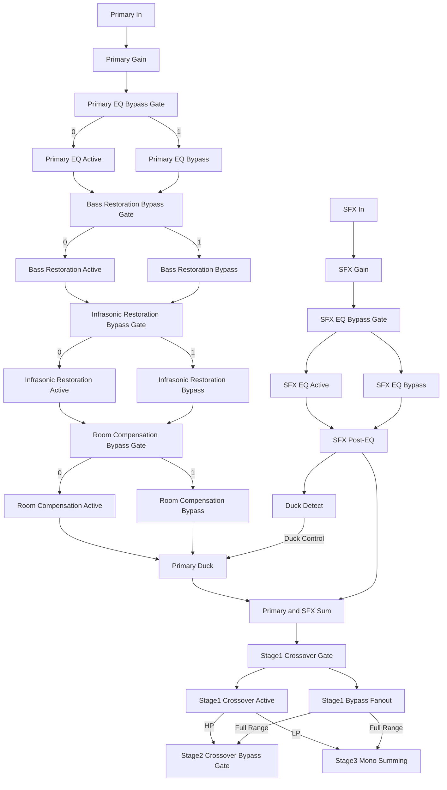
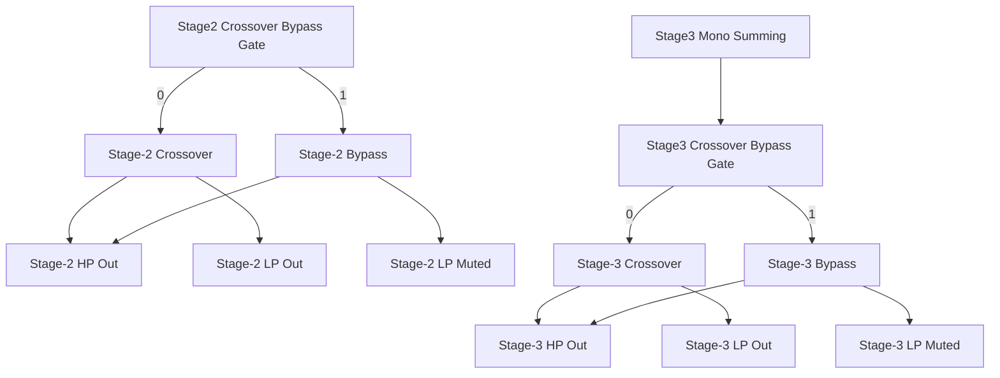
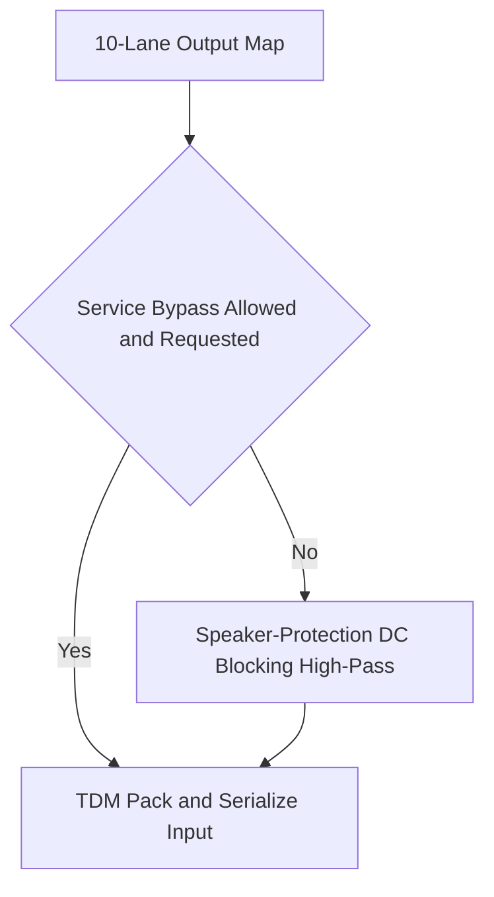

# Bypass Routing and Control

Back to the [root README](../README.md).

See also [ESP32 Core Logic](ESP32_Core_Logic.md), [Timing Policy](Timing_Policy.md), [Bass and Infrasonic Restoration](Bass_Infrasonic_Restoration.md), and the [SPI Register Manual](Register_Manual.md).

## Purpose

The host controls stage routing and bypass behavior through enable masks and protection-selector registers.

- For bypass controls: `0` means bypass disabled, `1` means bypass enabled.
- Power-on defaults are all zeros.
- The fixed 6x10 routing matrix is implemented in Core 0; host controls gate behavior around that matrix.
- There is no separate channel-mode register in the current ABI.

## Registers

| Address | Name | Access | Description |
| --- | --- | --- | --- |
| `0x00A1` | `MTR_SYS_ENABLE_1` | RW | Routing, channel-mode, and mute-target control mask group 1. |
| `0x00A6` | `MTR_PRIMARY_BYPASS_MASK` | RW | Per-primary-lane bypass mask (EQ/restoration/room-comp/xover stage-1/xover stage-2) plus shared stage-3 bypass. |
| `0x00A7` | `MTR_SFX_BYPASS_MASK` | RW | Per-SFX-lane bypass mask (SFX EQ). |
| `0x00E0` | `MTR_PROTECT_SEL_CTRL` | RW | Service/protection bypass request and force-protected control. |
| `0x00E4` | `MTR_PROTECT_SEL_STAT` | R | Service/protection bypass status bits. |
| `0x00E8` | `MTR_PROTECT_SEL_TMR` | R | Remaining service bypass timer seconds. |

## Bitfields

### `MTR_SYS_ENABLE_1` (`0x00A1`)

- Bit `0`: `PRIMARY_4CH_MODE_ENABLE` (`0` = primary 2-channel mode, `1` = primary 4-channel mode)
- Bit `1`: `SFX_STEREO_MODE_ENABLE` (`0` = SFX mono mode, `1` = SFX stereo mode)
- Bit `2`: `USER_MUTE_OVERRIDE` (`0` muted target, `1` unmuted target)
- Bits `[31:3]`: reserved

### `MTR_PROTECT_SEL_CTRL` (`0x00E0`)

- Bit `0`: request service bypass when hardware selector is in bypass position
- Bit `1`: force protected mode and clear bypass request

### `MTR_PROTECT_SEL_STAT` (`0x00E4`)

- Bit `0`: selector pair valid
- Bit `1`: selector still debouncing
- Bit `2`: service bypass active
- Bit `3`: service timeout expired

### `MTR_PRIMARY_BYPASS_MASK` (`0x00A6`)

All bits use bypass-enable semantics (`0` bypass disabled, `1` bypass enabled).

- Bits `[3:0]`: primary EQ bypass for `CH0..CH3`
- Bits `[7:4]`: bass restoration bypass for `CH0..CH3`
- Bits `[11:8]`: infrasonic restoration bypass for `CH0..CH3`
- Bits `[15:12]`: room-compensation bypass for `CH0..CH3`
- Bits `[19:16]`: crossover stage-1 bypass for `CH0..CH3`
- Bits `[23:20]`: crossover stage-2 bypass for `CH0..CH3`
- Bit `24`: shared stage-3 crossover bypass after mono summing
- Bits `[31:25]`: reserved

### `MTR_SFX_BYPASS_MASK` (`0x00A7`)

All bits use bypass-enable semantics (`0` bypass disabled, `1` bypass enabled).

- Bit `0`: SFX EQ bypass for `CH4`
- Bit `1`: SFX EQ bypass for `CH5`
- Bits `[31:2]`: reserved

## Runtime Notes

- Service bypass activation is conditional on selector validity, stability, and timeout state.
- Force-protected immediately clears active service request state.
- Crossover and restoration bypass bits are consumed in Core 0 during per-sample routing.
- This document section shows register-addressable bypass points only (no non-ABI conceptual bypass nodes).

Transition protection policy for route/source changes:

- Any bypass switch or pink-noise source-mask change triggers an automatic transition-protection envelope.
- Route/source changes are committed at mute floor.
- Canonical envelope values and startup/mute timing interactions are defined in [Timing Policy](Timing_Policy.md).

---

## Register-Addressable Bypasses

Current firmware implements these bypass controls:

- Service protection bypass gate (`0x00E0/0x00E4/0x00E8`)
- Primary EQ per-lane bypass via `MTR_PRIMARY_BYPASS_MASK` bits `[3:0]`
- Bass restoration per-lane bypass via `MTR_PRIMARY_BYPASS_MASK` bits `[7:4]`
- Infrasonic restoration per-lane bypass via `MTR_PRIMARY_BYPASS_MASK` bits `[11:8]`
- Room-compensation per-lane bypass via `MTR_PRIMARY_BYPASS_MASK` bits `[15:12]`
- Crossover stage-1 per-lane bypass via `MTR_PRIMARY_BYPASS_MASK` bits `[19:16]`
- Crossover stage-2 per-lane bypass via `MTR_PRIMARY_BYPASS_MASK` bits `[23:20]`
- Shared crossover stage-3 bypass via `MTR_PRIMARY_BYPASS_MASK` bit `24`
- SFX EQ per-lane bypass via `MTR_SFX_BYPASS_MASK` bits `[1:0]`

Service Speaker-protection bypass policy:

- Host register request must be asserted and the physical selector validity/stability checks must permit bypass.
- Service bypass is intended to bypass only the final speaker-protection DC-blocking high-pass stage (last practical step before TDM pack/serialize).

### Canonical Signal Topology (Single-Lane Reference, Primary Path Applies 4x)

Primary/SFX ordering follows README intent:

- Primary: gain -> EQ -> restoration -> room-comp -> duck -> sum
- SFX: gain -> EQ -> duck detect -> per-side inject at duck/sum

### Crossover Bypass Behavior Map

### Final Speaker-Protection Bypass Tail

