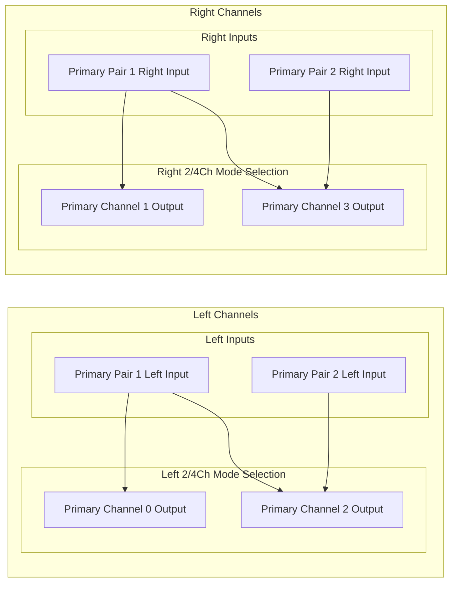
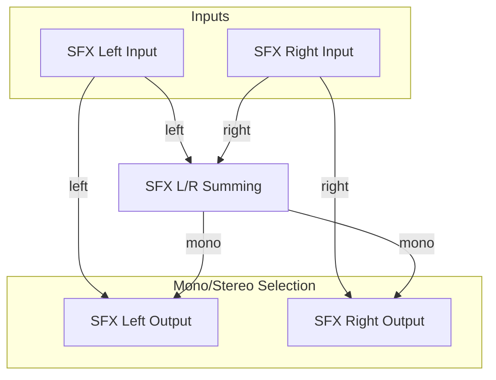

# Channel Configuration

Back to the [root README](../README.md).

## Purpose

This document defines the intended channel-mode behavior for the DSP input paths.

It focuses on two areas:

- Primary input operating mode: 2-channel or 4-channel.
- SFX input operating mode: stereo or mono.

## Primary Input Modes

The primary path supports two operating modes.

### 4-Channel Primary Mode

Use this mode when all four primary input channels are available and should remain independent.

Expected behavior:

- Primary Channel 0 Output = Primary Pair 1 Left Input.
- Primary Channel 1 Output = Primary Pair 1 Right Input.
- Primary Channel 2 Output = Primary Pair 2 Left Input.
- Primary Channel 3 Output = Primary Pair 2 Right Input.

### 2-Channel Primary Mode

Use this mode when only one stereo primary source is active.

Expected behavior:

- Primary Channel 0 Output = Primary Pair 1 Left Input.
- Primary Channel 1 Output = Primary Pair 1 Right Input.
- Primary Channel 2 Output = Primary Pair 1 Left Input.
- Primary Channel 3 Output = Primary Pair 1 Right Input.

## SFX Input Modes

The SFX path supports stereo and mono operation.

### Stereo SFX Mode

Use this mode when left and right SFX channels should remain independent.

Expected behavior:

- SFX Left Output = SFX Left Input.
- SFX Right Output = SFX Right Input.

### Mono SFX Mode

Use this mode when SFX content should be collapsed to one shared signal.

Expected behavior:

- SFX Mono = SFX Left Input + SFX Right Input.
- SFX Left Output = SFX Mono.
- SFX Right Output = SFX Mono.

## Gain and Metering Expectations

Mode selection does not remove existing gain, clip, or metering checkpoints.

The following should remain observable across modes:

- Ingress normalization behavior.
- Pre-sum and post-sum signal headroom.
- Pre-crossover clip and meter behavior.

## Runtime Control Expectations

Channel mode controls are expected to be host-selectable through the control interface.

Canonical bit assignments:

- `MTR_SYS_ENABLE_1` bit `0` (`PRIMARY_4CH_MODE_ENABLE`): `0` = primary 2-channel mode, `1` = primary 4-channel mode.
- `MTR_SYS_ENABLE_1` bit `1` (`SFX_STEREO_MODE_ENABLE`): `0` = SFX mono mode, `1` = SFX stereo mode.

When mode changes occur at runtime, updates should take effect at stable processing boundaries to avoid partial-block transitions.

## Notes

Detailed register definitions and bit assignments for channel-mode selection should be maintained in the register-focused documentation files.
