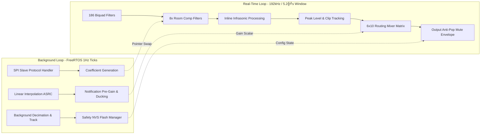

# ESP32 Core Logic

Back to the [root README](../README.md).

## 2. Asymmetric Core Workload Allocation

The ESP32-P4 split-core processing environment isolates real-time audio sample calculations from background communication, translation, and non-volatile maintenance tasks. The core doing the DSP things is going to be working very, very hard, and I'll need to keep an eye on die temperatures to make sure my magic rock keeps its magic smoke inside.

### Core 0 (Audio Muscle Thread)

* **Real-Time Execution Window**: Exactly **5.2 microseconds** per sample block boundary at 192kHz.
* **Algorithmic Payload**:
  * 186 Biquad filter operations (6 input channels * 31 graphic equalizer frequency bands).
  * 8x localized Room Compensation Biquad matrix filters.
  * Accelerated linear math operations using raw arrays and single-precision floating-point primitives.
  * Comprehensive real-time Peak Level and Inter-Stage Clipping Tracking routines.
  * 6x10 digital audio mixing routing matrix.
  * Hardware-optimized output anti-pop mute envelope integration.

### Core 1 (Brain & Control Thread)

* **Execution Paradigm**: Low-priority background FreeRTOS control thread loop.
* **Algorithmic Payload**:
  * Background SPI Slave communication protocol handling incoming updates from an external UI host.
  * Trigonometric filter coefficient generation, updated via a lock-free double-buffered pointer-swap mechanism.
  * Linear interpolation 4x Asynchronous Sample Rate Converter (ASRC) upsampling incoming notifications from 48kHz to 192kHz.
  * Primary Notification Input attenuation stage and Ducking Envelope tracker.
  * Subharmonic/Infrasonic long-window tracking, completely isolated from Core 0 to prevent watchdog starvation timeouts.
  * Safety Non-Volatile Storage (NVS) Flash Wear Management System.

## External Flash And Memory Assumptions

This project assumes external SPI NOR flash for firmware and persistent storage.

* ESP32-P4 firmware images (bootloader, partition table, app, NVS) are stored in external SPI NOR flash.
* Current project configuration targets `2MB` SPI flash (`CONFIG_ESPTOOLPY_FLASHSIZE="2MB"`).
* NVS writes from Core 1 use that same external flash device.

PSRAM is not currently required by this codebase configuration.

* `CONFIG_SPIRAM` is not enabled in the current project config.
* Real-time hot paths are intentionally kept in internal SRAM for deterministic DSP behavior.

## Routing, Bypass, And Channel Modes

The fixed 6x10 output routing matrix lives in Core 0, but the host controls its operating state through the SPI enable masks and the protection selector.

* `MTR_PRIMARY_BYPASS_MASK` carries per-primary-lane bypass controls and the shared Stage-3 crossover bypass (`bit 24`).
* `MTR_SFX_BYPASS_MASK` carries per-SFX-lane EQ bypass controls (`bits [1:0]`).
* `MTR_SYS_ENABLE_1` carries primary-mode bit, SFX mode bit, and user mute-target override.
* `MTR_PROTECT_SEL_CTRL`, `MTR_PROTECT_SEL_STAT`, and `MTR_PROTECT_SEL_TMR` expose the service/protection bypass selector state.
* `MTR_VOL_MUTE_CTRL` provides the final digital mute and DAC soft-mute requests.
* `MTR_VOL_MASTER` drives DAC digital attenuation (PCM1795 registers `0x10/0x11`) for user master loudness.
* There is no separate channel-mode register; channel behavior is expressed through these enable-mask bits and the runtime routing matrix.

## 3. High-Performance SPI Register Map

The canonical register ABI lives in [Register_Manual.md](Register_Manual.md). This section now provides only an orientation subset to avoid drift.

### Key Control and Status Registers (Orientation Subset)

| Address | Register | Notes |
| --- | --- | --- |
| `0x00A1` | `MTR_SYS_ENABLE_1` | Primary/SFX mode bits and user mute override. |
| `0x00A8` | `MTR_SYS_STATUS` | Runtime mute/boot/input-valid/clip summary bits. |
| `0x00B0..0x00BC` | `MTR_PEAK_OUT_0..3` | Live output peak mirrors (float bits). |
| `0x00C0` | `MTR_CLIP_WARN_FLAGS_LO` | Sticky clip flags low half (`[31:0]`), clear-on-read for low half. |
| `0x00C4` | `MTR_CLIP_WARN_FLAGS_HI` | Sticky clip flags high half (`[63:32]`), clear-on-read for high half. |
| `0x00AC` | `MTR_BOOT_DELAY_MS` | Boot hold parameter in milliseconds (firmware scales to samples). |
| `0x00D0` | `MTR_FLASH_CMD` | Write `0x51A151A1` to force immediate NVS commit. |
| `0x00D4` | `MTR_FLASH_TIMER_STAT` | NVS timer status (`0xFFFFFFFF` when clean; else seconds remaining). |

### Canonical Bitfield Source

For host integration, always treat [Register_Manual.md](Register_Manual.md) as the ABI source of truth for:

* `MTR_SYS_ENABLE_1` mode bits (including primary 4-channel and SFX stereo mode bits).
* `MTR_CLIP_WARN_FLAGS_LO` / `MTR_CLIP_WARN_FLAGS_HI` split clear-on-read semantics.
* Reserved-bit behavior and write constraints.
