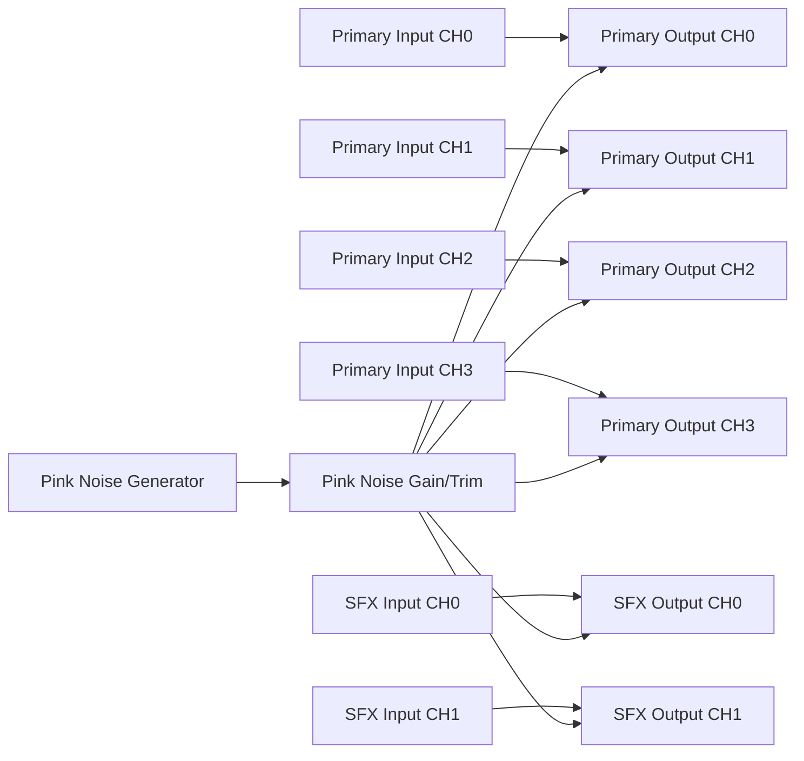

# Pink Noise Generator

Back to the [root README](../README.md).

See also [Bypass Routing and Control](Bypass_Routing_and_Control.md), [Timing Policy](Timing_Policy.md), and [Audio Topology Justifications](Audio-Topology_Justifications.md).

## Purpose

This document defines the pink-noise generator implementation, operating assumptions, and active routing/control surface.

## Implementation Summary

The generator is implemented in `main/Core1_PinkNoiseGenerator.hpp` as a low-cost Voss-McCartney style approximation using three octave-spaced random taps.

- PRNG: xorshift32
- Tap update periods: `1`, `16`, `256` samples
- Output shaping: equal tap sum, scaled by `OUTPUT_SCALE = 0.5`
- Runtime controls: `setEnabled(bool)` and `setGain(float)` with gain clamp `0.0..1.0`

## Runtime Behavior

- When disabled, `generateSample()` returns `0.0`.
- When enabled, each call produces one sample of colored-noise output.
- The generator is initialized in Core1 control task startup.
- Core0 applies generator output immediately after ingress deinterleave and before DSP clip/meter paths.

## Control Registers

| Address | Name | Access | Description |
| --- | --- | --- | --- |
| `0x0100` | `MTR_PINK_NOISE_SRC_MASK` | RW | Bits `[5:0]` select input channels CH0..CH5 to replace with pink noise (`1`=replace). |
| `0x0104` | `MTR_PINK_NOISE_GAIN_TRIM` | RW | float32 pink-noise gain trim scalar, clamped `0.0..2.0`. |

Transition protection policy for route/source changes:

- Route/source changes use the canonical transition-protection envelope and are committed at mute floor.
- See [Timing Policy](Timing_Policy.md) for authoritative timing values and host-side timing expectations.

## PInk Noise Connection Topology

In this section we describe how the pink noise generator is configured and connected.

Current topology in firmware:

- Four primary-channel input objects map through the primary signal path to four primary-channel output objects.
- Two SFX input objects map through the SFX signal path to two SFX output objects.
- The pink noise generator feeds the Pink Noise Gain/Trim object.
- Gain/trim output can replace any combination of input channels CH0..CH5 via source-mask control.

## Intended Use Cases

- Factory/service diagnostics
- Speaker and channel verification
- Quick signal-path sanity checks without external program material

## Constraints

- Pink-noise source replacement currently targets CH0..CH5 only.
- Source replacement happens pre-DSP; downstream processing still applies normal EQ, ducking, crossover, and output limits.
- The generator's internal gain is held at unity while external gain/trim (`0x0104`) defines injection level.

## Recommended Next Integration Step

For production hardening, add optional NVS persistence for pink-noise source-mask and gain/trim defaults, and document recommended service-level limits per amplifier topology.

## Verification Checklist

1. Confirm generator enabled state and gain can be changed at runtime.
2. Confirm expected RMS level at unity gain after output path limits.
3. Confirm channel routing destination and mute interaction behavior.
4. Confirm no clip-latch flood when pink noise is active at intended service levels.
