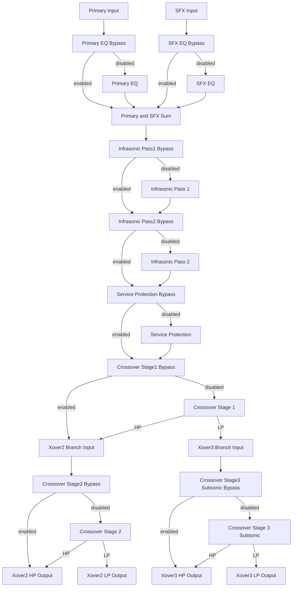
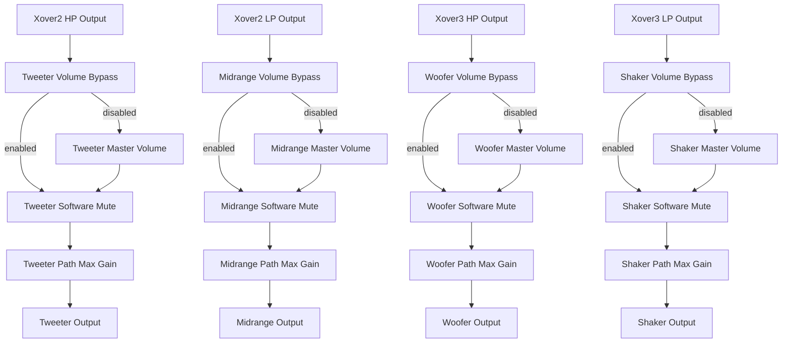

# Setup And Commissioning Guide

Back to the [root README](../README.md).

See also the [SPI Register Manual](Register_Manual.md) and [Timing Policy](Timing_Policy.md).

For a single scripted bring-up path, see the [Quick Start Script in the Software Integration Guide](Software_Integration_Guide.md#quick-start-script-power-on-to-first-verified-audio).

For canonical startup and mute timing envelopes, see [Timing Policy](Timing_Policy.md).

## Purpose

This guide covers first-power setup and baseline commissioning. It is workflow-oriented and separate from the raw register list.

## Required Information Before Power-Up

| Item | Why It Matters |
| --- | --- |
| Expected ABI version | Prevents host code from writing an incompatible register map. |
| Amplifier/channel safe gain limits | Prevents overdrive during initial audio checks. |
| Initial crossover frequencies | Ensures lane routing starts in a known safe acoustic range. |
| Mute behavior policy | Avoids pops and uncontrolled output during startup. |
| IRQ policy | Determines whether host runs poll-only or interrupt-assisted metering. |

## Bring-Up Sequence

1. Verify SPI link and register ABI compatibility.
2. Force safe startup state (muted and conservative gains).
3. Program crossover and routing mode controls.
4. Program master volume and path ceilings.
5. Enable interrupt behavior (optional) and verify status.
6. Unmute in controlled steps and confirm metering.

## Speaker Protection Bypass For Calibration

Use service bypass only for controlled calibration windows.

- Request path: `MTR_PROTECT_SEL_CTRL` (`0x00E0`) bit `0`
- Force-protected path: `MTR_PROTECT_SEL_CTRL` (`0x00E0`) bit `1`
- Status view: `MTR_PROTECT_SEL_STAT` (`0x00E4`)
- Remaining window: `MTR_PROTECT_SEL_TMR` (`0x00E8`)

### Calibration Bypass Sequence (Host Side)

```python
# 1) Request service bypass (only activates if hardware selector allows it)
write_u32(0x00E0, 0x00000001)

# 2) Poll status until active or rejected
stat = read_u32(0x00E4)
selector_valid = (stat & (1 << 0)) != 0
selector_stable = (stat & (1 << 1)) == 0
service_active = (stat & (1 << 2)) != 0
timeout_expired = (stat & (1 << 3)) != 0

# 3) While calibrating, monitor remaining timer
seconds_left = read_u32(0x00E8)

# 4) Exit bypass explicitly when done
write_u32(0x00E0, 0x00000002)  # force protected
```

### Safety Rules

- Keep master volume low and path gain ceilings conservative during bypass.
- Confirm `service_active` (bit `2`) before assuming bypass is engaged.
- If timeout expires (bit `3`), immediately return to protected workflow.
- Always force protected mode at the end of calibration.

## Which Bypasses Are Currently Implemented

Current firmware implements these bypass controls:

- Service protection bypass gate (`0x00E0/0x00E4/0x00E8`)
- Primary EQ per-lane bypass via `MTR_PRIMARY_BYPASS_MASK` bits `[3:0]`
- Bass restoration per-lane bypass via `MTR_PRIMARY_BYPASS_MASK` bits `[7:4]`
- Infrasonic restoration per-lane bypass via `MTR_PRIMARY_BYPASS_MASK` bits `[11:8]`
- Room-compensation per-lane bypass via `MTR_PRIMARY_BYPASS_MASK` bits `[15:12]`
- Crossover stage-1 per-lane bypass via `MTR_PRIMARY_BYPASS_MASK` bits `[19:16]`
- Crossover stage-2 per-lane bypass via `MTR_PRIMARY_BYPASS_MASK` bits `[23:20]`
- Shared crossover stage-3 bypass via `MTR_PRIMARY_BYPASS_MASK` bit `24` (`1` = bypass)
- SFX EQ per-lane bypass via `MTR_SFX_BYPASS_MASK` bits `[1:0]`
- Primary lane-mode select via `MTR_SYS_ENABLE_1` bit `0` (`0` = 2-channel mode, `1` = 4-channel mode)
- SFX lane-mode select via `MTR_SYS_ENABLE_1` bit `1` (`0` = mono mode, `1` = stereo mode)

Practical meaning: the previously listed bypass surfaces are now implemented in the runtime path.

### Bypass Locations In Signal Flow



Output-lane continuation (vertical view):



See [Routing, Bypass, and Channel Modes](Bypass_Routing_and_Control.md) for detailed bypass signal flow diagrams and bypass implementation status.

## Host Functions And Example Calls

The example below is host-side pseudocode using helper functions.

```python
# Transport primitives
read_u32(addr)
write_u32(addr, value)
write_f32(addr, value)
read_f32(addr)

# 1) ABI compatibility checks
abi_version = read_u32(0x0000)
abi_caps = read_u32(0x0004)
assert abi_version == 0x20260629

# 2) Safe startup defaults
write_u32(0x0114, 0x00000003)     # software mute + DAC soft mute request
for i, addr in enumerate([0x0130, 0x0134, 0x0138, 0x013C, 0x0140, 0x0144]):
    write_f32(addr, 0.50)         # conservative per-path ceiling
write_f32(0x0110, 0.20)           # low master volume

# 3) Routing and crossover baseline
write_u32(0x00A1, 0x00000004)     # USER_MUTE_OVERRIDE=1 (unmuted target), primary 2ch and SFX mono defaults
write_u32(0x00A6, 0x00000000)     # all primary bypasses disabled (processing active)
write_u32(0x00A7, 0x00000000)     # SFX EQ bypasses disabled (EQ active)
write_u32(0x00EC, (3000 << 16) | 175)   # xover1=3000Hz, xover0=175Hz
write_u32(0x00F0, (10 << 16) | 25)      # protectHP=10Hz, xover2=25Hz

# 4) Volume contour baseline
write_u32(0x011C, 0x00000001)     # ISO226 enabled
write_f32(0x0120, 0.75)           # contour depth
write_f32(0x0124, -12.0)          # contour reference dB

# 5) Optional IRQ setup
write_u32(0x0084, 0x00000003)     # meter-ready + clip-latch IRQ enabled

# 6) Controlled unmute sequence
write_u32(0x0114, 0x00000002)     # release software mute first
write_u32(0x0114, 0x00000000)     # then release DAC mute
```

## Why These Values

- `MTR_VOL_MUTE_CTRL = 0x3` starts in hard-safe silence at both digital and DAC boundaries.
- Path max gains at `0.5` provide startup headroom while tuning levels.
- Low master volume (`0.20`) reduces startup shock even if source is hot.
- Starting crossover enabled with explicit setpoints avoids ambiguous routing behavior.
- ISO226 depth below `1.0` keeps compensation noticeable but not extreme on first pass.

## Commissioning Checks

- Read `MTR_VOL_STATE` (`0x0118`) after each mute transition.
- Read `MTR_SYS_STATUS` (`0x00A8`) and verify ADC-valid and no clip flags.
- Read meter page values (`0x00C8` and `0x00CC`) for expected signal presence.
- If clipping appears early, lower `MTR_VOL_MASTER` and/or per-path ceilings before EQ work.

## Pink Noise Test Signal Generation

The device includes a built-in pink noise source for speaker/channel verification and tuning.
Use source-mask replacement to inject pink noise into selected ingress lanes (`CH0..CH5`).

### Pink Noise Control Registers

| Address | Name | Access | Purpose |
| --- | --- | --- | --- |
| `0x0100` | `MTR_PINK_NOISE_SRC_MASK` | RW | Bits `[5:0]` replace input channels `CH0..CH5` with pink noise (`1` = replace, `0` = pass through source). |
| `0x0104` | `MTR_PINK_NOISE_GAIN_TRIM` | RW | float32 pink-noise gain trim scalar, clamped `0.0..2.0`. |

### Gain Control Semantics

- **Minimum (`0.0`)**: pink-noise injection is silent.
- **Unity (`1.0`)**: nominal pink-noise injection level.
- **Maximum (`2.0`)**: +6 dB relative to unity trim.
- **Range**: IEEE-754 single-precision float; firmware clamps invalid values to `0.0..2.0`.
- **Update latency**: Immediate; no sample-boundary alignment required.

### Practical Pink Noise Workflow

```python
# 1) Set injection gain trim
write_f32(0x0104, 1.0)

# 2) Replace CH0 and CH1 with pink noise
# bit0 -> CH0, bit1 -> CH1
write_u32(0x0100, 0x00000003)

# 3) Monitor speaker output for presence on expected lanes
speaker_output = read_speaker_metering()

# 4) Sweep gain for level calibration
for target_db in [-40, -30, -20, -10, 0]:
    # Convert dB to linear gain: 10^(dB/20)
    linear_gain = 10.0 ** (target_db / 20.0)
    write_f32(0x0104, linear_gain)
    time.sleep(0.5)
    metering = read_peak_meters()
    print(f"Gain {target_db}dB: {metering}")

# 5) Return to normal source ingress
write_u32(0x0100, 0x00000000)
```

### Pink Noise Buffer and Routing

- **Replacement point**: source replacement occurs after ingress deinterleave and before DSP clip/meter paths.
- **Lane coverage**: source-mask replacement currently targets `CH0..CH5` only.
- **Disable behavior**: clear corresponding bits in `MTR_PINK_NOISE_SRC_MASK` to restore normal channel ingress.

For canonical behavior/details, see [Pink_Noise_Generator.md](Pink_Noise_Generator.md) and [Register_Manual.md](Register_Manual.md).
