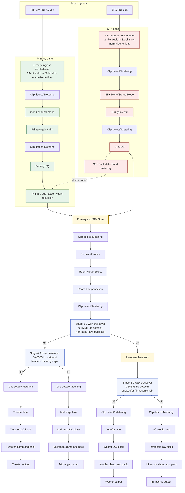

# Single Channel Flow

Back to the [root README](../README.md).

This document is the compact signal-path reference used while iterating controls and runtime behavior.

## Notes

- This page is flow-oriented and intentionally concise.
- Bypass-specific signal variants are documented in [Setup and commissioning guide](Setup_Commissioning_Guide.md#bypass-locations-in-signal-flow).
- Register-level controls for each stage are documented in [Register Manual](Register_Manual.md).
